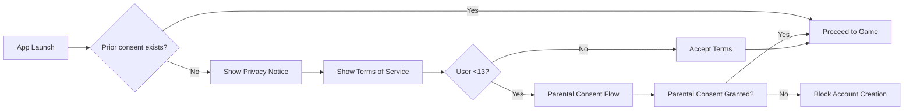

# Deep Research on Data Collection for Unity Mobile Gacha RPG (Engineering + Compliance)

## Executive summary

This report outlines a **comprehensive approach** to telemetry and data practices for a Unity-built gacha-style turn-based co-op RPG, balancing technical needs with legal compliance. The output includes recommended event schemas, telemetry patterns, privacy-by-design flows, data retention policies, and CI automation for documentation. The goal is to **maximize player experience and operational insight while respecting privacy laws and platform policies**.

Key takeaways:
- **Event taxonomy & schemas:** Define core game events (e.g., `session_start`, `gacha_pull`, `purchase`) with JSON schemas for consistent logging.
- **Consent and privacy:** Design in-app consent UIs and logging to meet GDPR/CCPA/COPPA principles (minimal data, lawful basis, DPIA triggers).
- **Client telemetry patterns:** Use Unity C# with async batches, local queue, encryption-at-rest, and respect consent flags.
- **Server audit logs:** Store immutable logs of purchases and gacha draws (SQL schema) to enable auditing (e.g., for Chinese 90-day probability rules).
- **CI/CD checks:** Automate snapshots of legal docs, event schemas, and AI model terms in version control for traceability.
- **Monitoring stack (free-tier):** Recommend options like Firebase Analytics, Supabase, Google Play Console, Unity Gaming Services, Sentry, ensuring cost-awareness and sampling strategies.
- **Security & performance:** Ensure data encryption in transit/at-rest, limit network egress (batching, compression), and optimize event sampling for large-scale operations.

The plan is organized into sections covering these technical and legal aspects, with example schemas, code snippets, data flows (Mermaid diagrams), and implementable checklists. This report references primary official sources where relevant, and a roadmap with priorities is included.  

*Disclaimer:* This is an informational overview, not legal advice. Please consult legal counsel and Unity/network security experts when implementing these recommendations.

## Event taxonomy and example schemas

A consistent event taxonomy and schema are crucial for analytics and audits. Key event categories include:

- **Session events:** track app launches and quits.
- **User actions:** purchases, gacha pulls/results, mission completions, matchmaking events, chat/reporting.
- **System events:** crashes, performance samples.
- **Consent events:** acceptance of terms/privacy.
- **Security/cheat events:** flagging abnormal behavior.

Below are example JSON schemas for core events. In practice, each event should include a unique `event_id`, timestamp, and minimal user identifier or hashed device ID under lawful basis. Fields in **bold** are unique IDs or timestamps.

```json
{
  "event": "session_start",
  "event_id": "uuid-v4-...",
  "user_id": "anon_or_user123",
  "timestamp": "2026-03-06T15:04:05Z",
  "platform": "Android",
  "version": "1.0.3",
  "locale": "en-US"
}
```

```json
{
  "event": "purchase",
  "event_id": "uuid-...",
  "user_id": "anon_or_user123",
  "timestamp": "2026-03-06T15:10:10Z",
  "item_id": "gem_pack_large",
  "payment_type": "IAP",
  "currency": "USD",
  "amount": 4.99,
  "order_id": "google-TRANSACTION123"
}
```

```json
{
  "event": "gacha_pull",
  "event_id": "uuid-...",
  "user_id": "user123",
  "timestamp": "2026-03-06T15:15:00Z",
  "banner_id": "limited_ninja_evergreen",
  "uses_currency": "PAID_GEMS",
  "count": 10
}
```

```json
{
  "event": "gacha_result",
  "event_id": "uuid-...",
  "user_id": "user123",
  "timestamp": "2026-03-06T15:15:01Z",
  "banner_id": "limited_ninja_evergreen",
  "items": [
    {"item_id": "rare_shuriken", "rarity": "Rare"},
    {"item_id": "common_potion", "rarity": "Common"},
    //...
  ]
}
```

```json
{
  "event": "mission_complete",
  "event_id": "uuid-...",
  "user_id": "user123",
  "timestamp": "2026-03-06T15:20:30Z",
  "mission_id": "stage5_3",
  "difficulty": "Hard",
  "success": true,
  "duration_seconds": 300
}
```

```json
{
  "event": "matchmaking_event",
  "event_id": "uuid-...",
  "user_id": "user123",
  "timestamp": "2026-03-06T15:25:00Z",
  "match_id": "match_456",
  "action": "enter_queue",
  "character_ids": ["ninja_A", "ninja_B"],
  "region": "US-East"
}
```

```json
{
  "event": "chat_message_report",
  "event_id": "uuid-...",
  "reporter_id": "user123",
  "timestamp": "2026-03-06T15:30:10Z",
  "reported_user_id": "user456",
  "message_id": "msg789",
  "reason": "Harassment"
}
```

```json
{
  "event": "consent_acceptance",
  "event_id": "uuid-...",
  "user_id": "user123",
  "timestamp": "2026-03-06T15:00:00Z",
  "document": "tos",
  "version": "1.0.0",
  "locale": "en-US"
}
```

```json
{
  "event": "crash_report",
  "event_id": "uuid-...",
  "user_id": "user123",
  "timestamp": "2026-03-06T15:31:00Z",
  "error": "NullReferenceException",
  "stack_trace": "at Game.Update()...",
  "device_model": "Pixel 6"
}
```

```json
{
  "event": "performance_sample",
  "event_id": "uuid-...",
  "timestamp": "2026-03-06T15:32:00Z",
  "fps": 58,
  "cpu_usage": 35.2,
  "memory_mb": 512.7
}
```

These schemas should be enforced client- and server-side to ensure consistent analytics. Each JSON is a named example; actual events may vary. Ensure **minimum necessary PII** and rely on user-consented identifiers (see [GDPR data minimization](https://eur-lex.europa.eu/legal-content/EN/TXT/HTML/?uri=CELEX:32016R0679#d1e2410-86-1) principles).

## Client-side telemetry patterns (Unity)

Implement telemetry with user experience and compliance in mind:

- **Consent gating:** Do not collect any identifiable data until the user has consented. Show privacy/TOS acceptance at first launch (as per Google UGC rules). If consent is denied, disable all tracking but still allow app core functionality in offline mode.
- **Offline queue and batching:** Use an asynchronous, resilient queue for events (e.g., `ConcurrentQueue<Event>`). On event generation, enqueue the JSON to local storage (encrypted prefs or file). Periodically (or at session end), send batched payload via `UnityWebRequest` or HttpClient. This minimizes network overhead and respects intermittent connectivity.
- **Encryption at rest and in transit:** Store queued events encrypted (e.g., AES with app-specific key). Always use HTTPS/TLS for upload. For added security, use platform secure storage (Keystore/Keychain) for any keys. This is part of privacy-by-design.
- **Asynchronous APIs:** Wrap telemetry in async methods/coroutines so they do not block the main thread. E.g., using `async/await` with `UnityWebRequest.SendWebRequest()`.
- **Failure handling:** Retry on failure, but implement backoff to avoid endless loops. If the queue grows large, consider dropping oldest (to honor retention limits).
- **Performance monitoring:** Include low-frequency performance sampling to spot issues in production, but throttle the rate to avoid impacting bandwidth or battery.
- **Addressables/content telemetry:** Instrument Addressables load events (success/failure) and cache hits/misses to identify content delivery issues.
- **Anti-cheat telemetry:** Log abnormal in-game behaviors client-side (e.g., huge jumps in currency balance, speed hacks) flagged to server. Use obfuscation/anti-tamper to protect this logic.

_Sample C# pseudocode pattern for batching and offline queue:_

```csharp
public class TelemetryManager : MonoBehaviour {
    private Queue<string> eventQueue = new Queue<string>();
    private const string QUEUE_FILE = "telemetry_queue.json";

    void Awake() {
        LoadQueue();
    }

    public void TrackEvent(object evt) {
        if (!HasConsent()) return;
        string json = JsonUtility.ToJson(evt);
        lock (eventQueue) {
            eventQueue.Enqueue(json);
        }
    }

    IEnumerator Start() {
        while (true) {
            yield return new WaitForSeconds(30); // batch interval
            yield return SendBatch();
        }
    }

    private IEnumerator SendBatch() {
        List<string> batch = new List<string>();
        lock (eventQueue) {
            while (eventQueue.Count > 0 && batch.Count < 20) {
                batch.Add(eventQueue.Dequeue());
            }
        }
        if (batch.Count == 0) yield break;

        // encrypt batch if needed
        string payload = "[" + string.Join(",", batch) + "]";
        UnityWebRequest www = UnityWebRequest.Post("https://api.example.com/telemetry", payload);
        www.SetRequestHeader("Content-Type", "application/json");
        yield return www.SendWebRequest();

        if (www.result != UnityWebRequest.Result.Success) {
            // On failure, re-enqueue for retry
            foreach (var ev in batch) {
                lock (eventQueue) eventQueue.Enqueue(ev);
            }
        } else {
            // success: optionally log, clear persisted copy
            SaveQueue();
        }
    }

    void OnApplicationPause(bool pause) {
        if (pause) SaveQueue();
    }
    void OnApplicationQuit() {
        SaveQueue();
    }

    private void SaveQueue() {
        lock (eventQueue) {
            System.IO.File.WriteAllText(Application.persistentDataPath + "/" + QUEUE_FILE,
                JsonHelper.ToJson(eventQueue.ToArray()));
        }
    }
    private void LoadQueue() {
        string path = Application.persistentDataPath + "/" + QUEUE_FILE;
        if (System.IO.File.Exists(path)) {
            var arr = JsonHelper.FromJson<string>(System.IO.File.ReadAllText(path));
            lock (eventQueue) foreach (var ev in arr) eventQueue.Enqueue(ev);
        }
    }
}
```

This example uses batching of 20 events every 30 seconds, retrying failed sends. Adapt batch size and timing based on network conditions and cost considerations.

## Server-side audit logs and retention

On the server, **store critical events immutably** in a database with proper retention. Core tables:

```sql
CREATE TABLE audit_event (
  event_id   UUID PRIMARY KEY,
  event_type TEXT NOT NULL,          -- e.g. 'gacha_pull', 'purchase'
  user_id    TEXT NOT NULL,
  timestamp  TIMESTAMPTZ NOT NULL,
  data       JSONB NOT NULL          -- raw event data
);

CREATE TABLE gacha_pull (
  pull_id    UUID PRIMARY KEY,
  user_id    TEXT NOT NULL,
  banner_id  TEXT NOT NULL,
  timestamp  TIMESTAMPTZ NOT NULL,
  items      JSONB NOT NULL,
  FOREIGN KEY (pull_id) REFERENCES audit_event(event_id)
);
```

In the above, every action is logged as an `audit_event`. For gacha pulls, also store details (including generated RNG values if any) in a separate table. Ensure no UPDATEs to these tables; only INSERT, to preserve history.

**Retention and archival:**  
Implement scheduled jobs to move old records to archival storage. For example, after 365 days (or legal minimum) migrate rows older than threshold to a read-only archive table or export to secure cold storage. China’s rule suggests keeping random-draw logs *at least* 90 days; in absence of local requirements, a 1-year retention is prudent under GDPR and U.S. consumer rules.

**Data minimization:** Log only what’s necessary. For GDPR/CCPA, avoid storing precise GPS, device identifiers, or PII unless needed. Use pseudonymous user IDs.

**Consent logging:** Store each consent event (ToS acceptance) in a `consent_log` table (as in previous section’s schema). Retain these logs long enough to resolve disputes (e.g., until statute of limitations lapses).

## Privacy-by-design considerations

- **Lawful basis mapping:** Map each data category to a lawful basis. E.g., core gameplay data may be “contractual necessity” (to provide service), analytics may rely on “legitimate interest” (improving app) or **opt-in consent** for sensitive profiling. Use explicit consent for targeting/ads (COPPA compliance).
- **Data minimization:** Collect only fields you will use. For example, if analyzing region-level performance, do not store full GPS; store coarse region IDs.
- **Pseudonymization:** Where possible, use one-way hashes or user IDs instead of emails/real names. If you use a backend account, store an internal `user_id` rather than raw email.
- **Access controls:** Protect telemetry pipelines: ensure only authorized services/engineers can query raw user data, and require legal approvals for data exports.
- **DPIA triggers:** If you intend to combine telemetry with sensitive personal data (e.g. health-related gameplay), that may trigger a Data Protection Impact Assessment under GDPR Article 35. Generally, behavioral profiling (e.g. using gameplay patterns to influence purchases) can raise red flags. Incorporate DPIA if collecting or processing any special categories of data or systematically monitoring users beyond just app functionality.
- **Children’s data (COPPA/CCPA-CAL):** If you have a reason to suspect users under 13, disable targeted profiling and collect only essential data, with verifiable parental consent for any personal information. California law (CalOPPA/CPRA) requires privacy notices and a “Do Not Sell” opt-out link if user data might be sold to third parties.
- **Rights flows:** Implement user-accessible flows to access/delete data. For example, an in-app support option to request account data or deletion. Log and process these requests (GDPR Article 15/17; CCPA).

## Privacy UI flows (Mermaid diagram)

A typical consent flow for GDPR/COPPA:



This ensures no analytics or networking before consent. For COPPA, leverage safe-harbor checklists (e.g., Google AdMob has COPPA guides). After consent, you may show optional “analytics opt-in” if you need extra tracking.

## Analytics/monitoring stack recommendations

For a solo developer, free or low-cost tiers are vital. Consider:

- **Firebase Analytics (Google Analytics for Firebase):** Robust free analytics with built-in event types and A/B testing/remote config. No per-event fee (bill on data exports only). Integrates with Crashlytics, Performance Monitoring, In-App Messaging.  
- **Unity Gaming Services (Unity Analytics):** Unity offers analytics, remote config, and multiplayer backends. Free tier may suffice for small studios.  
- **PlayFab (Microsoft):** Free tier offers telemetry, economy, and matchmaking. Limited request quotas.  
- **Supabase:** Open-source Firebase alternative. Use it for authentication, database, and real-time. It has generous free plans (e.g., Postgres). ([supabase.com](https://supabase.com/pricing?utm_source=chatgpt.com))  
- **Sentry (Crash/Error monitoring):** Free up to 5k events/month for crash reporting. Integrate with Unity.  
- **BigQuery (Google Cloud):** For log analytics. Free 1 TB query per month. Good for storing large telemetry volumes for analysis.  
- **Prometheus/Grafana:** If self-hosting, for server metrics.  
- **Consent management:** If using Firebase, Android’s `play-services-ads-identifier` for CCPA/CCPA; for Apple, use AppTrackingTransparency framework. ([apple.com](https://developer.apple.com/documentation/apptrackingtransparency?utm_source=chatgpt.com))

**Integration notes:**  
- Use Google’s `UnityFirebase` SDK for analytics and remote config.  
- If using REST APIs (e.g., Supabase Realtime), ensure token auth via UnitySecureStorage.  
- For AB testing without vendor lock-in, maintain your own feature-flag config in a JSON blob and refresh from server.

## Cost optimization and sampling

High-frequency events (performance, fps samples, chat logs) can quickly accumulate. Strategies:

- **Sampling:** Only log every Nth frame for performance samples, or aggregate statistics per minute. For chat, only log reports or flagged content, not every message.  
- **Throttling:** Limit `session_end` events to unique sessions only (skip if already logged recently).  
- **Conditional logging:** Disable debug telemetry in production if not needed. Use `#if DEBUG` for dev-only logs.  
- **Edge processing:** Do minor aggregations client-side (e.g., count of minor events) and send periodically instead of every event.  
- **Compression:** Send batched JSON compressed via GZip (most backends support).
- **Free quotas:** Stay within Firebase / BigQuery free quotas by sampling or rate-limiting. Firebase Analytics has unlimited free event logging up to user caps, but exporting large BigQuery datasets can incur costs (monitor via billing alerts).

## Security considerations

- **Encryption:** Encrypt telemetry at rest on device and use TLS 1.2+ in transit.  
- **Key management:** Store any keys in OS-protected storage (Keychain/Keystore). For extra security, use a server-managed one-time pad or HMAC for particularly sensitive events (like fraud signals).  
- **HSM / secure RNG:** If you ever implement server-side RNG for fairness (commit–reveal), consider using a Hardware Security Module or cloud KMS to generate seeds and sign outputs, preventing tampering.  
- **Backend hardening:** Ensure your logging endpoints authenticate requests (e.g., using API keys or OAuth for your client apps).  
- **Data breach plan:** Have procedures if telemetry systems are compromised (e.g., how to disable data collection, notify users, etc.).

## Operational runbooks for disputes and forensics

Prepare procedures to extract evidence:

- **Evidence bundle for refunds/charges:** Given a user ID, script should pull all related events (purchases, currency spends, gacha results, logs) from the database and package them. This is essential for refund appeals or fraud investigations.
- **GDPR/CCPA subject access:** Automate data export (from audit logs and user profile tables) to fulfill “access request” within legal timeframe.
- **DMCA/rights dispute:** Be able to filter logs for content (chat/messages) posted by a user when investigating copyright claims; preserve reported content.
- **Gacha audit export:** For each banner period, publish (internal) the odds table and aggregate results. This supports transparency and compliance (e.g., Chinese “publish draw results”).  

## Telemetry vs legal requirements mapping

| Telemetry/Data Item       | Relevant Requirement                                   | Action/Log |
|---------------------------|--------------------------------------------------------|------------|
| User consent events       | GDPR consent, COPPA verifiable parental consent        | Log timestamp, version (see schema above) |
| App launch/usage events   | Legal basis (contract or interest); privacy notice     | Ensure privacy policy reference is shown |
| Purchase records          | Tax/VAT reporting; refund tracking (store policies)    | Store in both audit log and financial ledger |
| Gacha pull & results      | Chinese probability rules; fairness (Apple/ASA)        | Audit log (≥90 days), public odds disclosure |
| Error/crash reports       | Data minimization; do not log sensitive data           | Strip PII from stack traces; anonymize device IDs |
| Chat/report events        | UGC moderation policy; evidence for abuse/disputes     | Log reporter, reported IDs, message IDs |
| Analytics events (e.g. AB) | GDPR legit. interest or consent; opt-out (CCPA/Google) | Respect Do Not Track (e.g., Google AD ID reset) |
| Device/perf logs          | Security (not sensitive PII) and performance tuning    | Limit frequency; drop if no consent |
| Remote config/fetch logs  | Age gating enforcement; consent enforcement            | Use to disable tracking if consent not given |

## Implementation roadmap (milestones & time estimates)

1. **Core event schemas & client telemetry (2–4 weeks)**: Define JSON schemas; implement client logging + batching (high priority).  
2. **Privacy/UI flows (1–2 weeks)**: Build GDPR/COPPA-compliant consent dialogs; log acceptances.  
3. **Backend logging & database (1–3 weeks)**: Design audit tables; ingest initial events.  
4. **Loot-box compliance (1 week)**: Implement odds disclosure UI; backend retention for pull logs.  
5. **Analytics integration (2–4 weeks)**: Hook up Firebase/Supabase, configure free-tier analytics, define AB tests.  
6. **Security & QA (1–2 weeks)**: Pen-test logging API, ensure encryption & no PII leaks.  
7. **Legal docs & CI pipeline (1–2 weeks)**: Write Privacy Policy / TOS drafts; set up CI snapshot actions for docs and schemas.  
8. **Reviews and adjustments (ongoing)**: GDPR self-audit, COPPA readiness check, local compliance review as expansion nears.

Total rough: **10–20 weeks** of combined engineering/legal work, depending on scope. Prioritize data design and compliance foundation before heavy monetization or social features.

