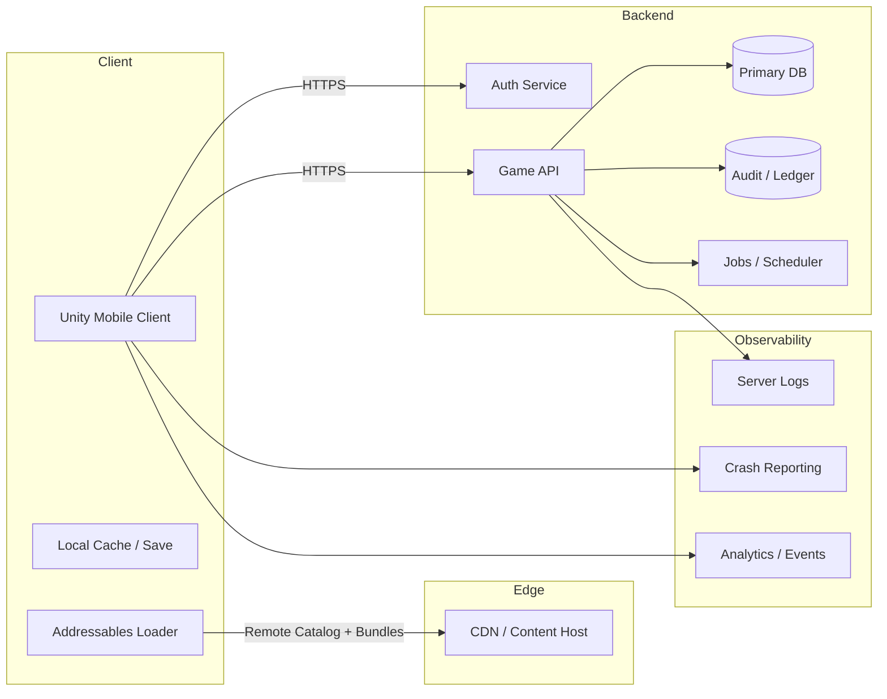
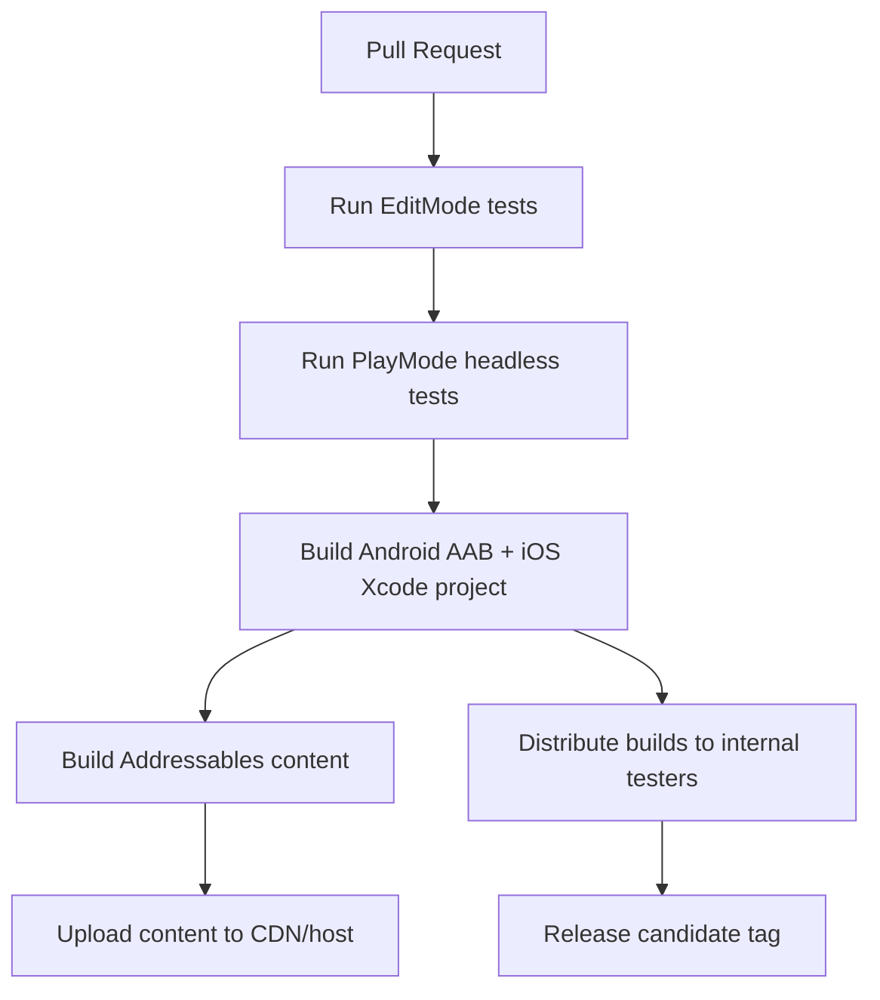
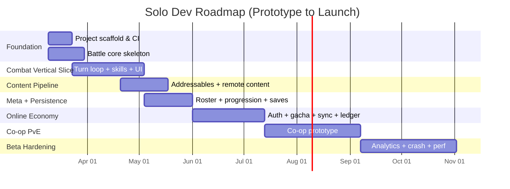

# Deep research: Engineering a solo-built mobile gacha tactical RPG in Unity for iOS and Android

## Executive summary

This report outlines a practical, engineering-focused plan to build a turn-based, gacha-style tactical RPG (portrait/mobile-first, “console-like polish but solo-dev constraints”) using Unity, modern mobile build requirements, and AI-assisted workflows. The recommended baseline for a new production is **Unity 6.3 LTS** (Unity version `6000.3`), because it is the current Long Term Support release with an explicitly supported lifecycle. citeturn0search0turn0search12

A gacha RPG’s core technical risk is not “combat code”; it is **state authority** (anti-cheat, purchases, entitlement integrity), **content pipeline** (fast iteration, remote updates), and **operational scalability** (LiveOps configs, analytics, crash reporting). Addressables provides a first-party way to stream/update content via a remote catalog and bundles, and Unity explicitly notes you can host remote Addressables content on any CDN/host (including Unity Cloud Content Delivery). citeturn14search0turn0search7turn0search16

For prototypes, the fastest path is an **offline-first vertical slice** with deterministic battle simulation and local persistence, followed by a **thin online layer** that introduces authentication + authoritative gacha/economy while keeping gameplay iteration unblocked. For cheap/free prototyping backends, the main contenders are Firebase (document DB + serverless + ubiquitous tooling), Supabase (Postgres + row-level security + edge/server functions), and PlayFab (game-specific economy/inventory/leaderboards + CloudScript). Their free tiers differ substantially and should be chosen based on what you want to validate first (combat feel vs. economy vs. co-op). citeturn1search8turn1search2turn22search0turn22search2turn12search3

Because you’re targeting iOS/Android, baseline compliance items must be designed in early: Apple explicitly requires loot box/randomized purchase odds disclosure, and both platforms expect secure purchase validation patterns via server-side verification when you operate a backend. citeturn1search7turn17search0turn17search18

## Product assumptions and MVP scope

Your uploaded GDD context (as described in your messages) implies a **turn-based tactical** game inspired by Ninja Blazing, with **co-op PvE** as a planned feature. The engineering plan below assumes:

- Portrait, one-hand UI patterns (combat HUD optimized for touch).
- Tactical grid combat with a turn order/initiative timeline.
- A “hero/unit collection” model (gacha), plus core progression and inventory.
- Co-op PvE as either (a) synchronous turn-based co-op (higher engineering/ops cost) or (b) asynchronous co-op/assist systems (lower networking complexity).

The MVP should prove **one thing**: “Is the battle loop sticky enough that players would keep playing even with a tiny roster?” Everything else (LiveOps cadence, multi-year economy tuning, large content pipeline) can be layered after.

A realistic MVP feature set for a solo developer typically includes:
- One fully playable combat vertical slice (3–5 missions), a small roster (8–12 units), basic progression, and one gacha banner.
- Basic offline play (for rapid iteration) but server-authoritative gacha/economy once you validate retention-relevant loops.
- A minimal co-op prototype (one mission type) only after single-player combat is stable, because co-op multiplies QA and state sync complexity.

Offline vs online stance (recommended):
- **Prototype phase**: offline-first (local saves, local gacha simulation) to validate feel, UX, and content cadence.
- **Beta+**: online-required for gacha economy, entitlement integrity, leaderboards, and co-op matchmaking/state.

## Client architecture in entity["company","Unity Technologies","game engine company"]

### Recommended Unity version and build baselines

**Recommendation:** Unity 6.3 LTS (`6000.3`) as the default for a new mobile production. Unity identifies 6.3 as the latest LTS release; its support page also documents its release/support cadence. citeturn0search0turn0search12

Mobile build constraints you must lock early:
- **iOS toolchain**: Apple requires App Store submissions be built with **Xcode 16+ and iOS 18 SDK** (as of April 24, 2025). citeturn4search1turn4search13  
  Unity’s iOS requirements also recommend Xcode 16+ for iOS development. citeturn4search4
- **Android publishing**: Google Play requires new apps be published as **Android App Bundles (AAB)**. citeturn4search0  
  Google Play target API policies change over time; as of the cited policy, new apps/updates must target Android 15 (API 35) by the stated deadlines. citeturn4search3turn4search9  
  Unity’s Android build process explicitly includes an option to “Build App Bundle (Google Play).” citeturn4search14

### Architecture goals for a gacha tactical RPG

For solo development, the architecture should optimize for:
- **Deterministic battle simulation** (testable without Unity scene dependencies).
- **Data-driven content** (units, skills, missions, banners in data assets).
- **Strict separation between “authoritative state” and “presentation.”**
- **Cheap iteration**: minimal domain reload pain, modular assemblies, predictable asset loading.

A practical pattern is:
- **GameCore (pure C#)**: battle rules, turn order, damage formulas, status effects, RNG interface, serialization of battle commands/replays.
- **GameClient (Unity)**: scenes, UI, input, animation, VFX, addressable loading.
- **GameNet (Unity + HTTP/WebSocket clients)**: API, auth tokens, sync, telemetry.

Use **Assembly Definition Files (asmdef)** so domain logic can compile independently and enable (a) faster compile cycles and (b) clean dependency boundaries.

### Packages and plugins (free/open-source preferred)

Core Unity packages to plan around (typical for this genre):
- **Addressables** for remote content distribution, remote catalogs, and content updates. Addressables builds catalogs, supports remote catalogs for updating content without a full app build, and has explicit guidance for remote distribution steps. citeturn0search7turn0search16turn14search0  
  Addressables uses the Scriptable Build Pipeline for AssetBundle builds, and Unity recommends Addressables for new projects rather than building AssetBundles directly. citeturn13search10
- **Input System** for cross-platform input and cleaner touch/gesture handling. Unity’s Input System docs describe it as the newer replacement for the classic Input Manager. citeturn0search17  
  For gesture-heavy gameplay, Input System touch support and EnhancedTouch can help with polling and touch history tracking. citeturn11search0turn11search1
- **UI Toolkit** if you want a more modern UI architecture; Unity documents runtime UI support and that UI Toolkit’s event system works with different input systems. citeturn8search3  
  Alternatively, uGUI remains viable for dense HUDs; choose one primary system to avoid dual-maintenance.
- **2D Animation** for sprite rigging/skinning workflows if you’re using 2D skeletal animation. Unity describes it as providing tooling/runtime components for rigging and animating 2D characters. citeturn9search1turn9search5turn9search8
- **Localization** package if you want scalable string/localized asset workflows. citeturn9search0turn9search4
- **Memory Profiler** for mobile memory optimization; Unity positions it as a dedicated tool to analyze memory usage via snapshots. citeturn9search2turn9search9turn10search3
- **Unity Test Framework** for Edit Mode + Play Mode tests and (optionally) running tests on target platforms. citeturn21search4turn21search1

Recommended open-source Unity ecosystem libraries (battle-tested for solo dev):
- **UniTask** for allocation-friendly async/await patterns in Unity (MIT licensed). citeturn8search0
- **VContainer** (MIT) for dependency injection with minimal GC overhead, useful for keeping architecture modular without a large framework. citeturn8search1
- Optional: **MessagePipe** for high-performance pub/sub (event bus) patterns if you want strict decoupling between UI, combat, and state changes. citeturn8search2

### Sample Unity project folder layout

A folder layout that scales to gacha-style feature growth while keeping “core logic” clean:

```text
Assets/
  _Project/
    _Config/
      Build/
      Environments/
      Quality/
    _Core/
      Runtime/
        Battle/
        Economy/
        Progression/
        SaveSystem/
        Shared/
      Editor/
      Tests/
    _Client/
      Runtime/
        Bootstrap/
        Scenes/
        UI/
        Input/
        Audio/
        VFX/
        Animation/
        Presentation/
      Editor/
      Tests/
    _Net/
      Runtime/
        Api/
        Auth/
        Sync/
        Telemetry/
    _Content/
      Addressables/
        Groups/
        Profiles/
      ScriptableObjects/
        Units/
        Skills/
        Missions/
        Gacha/
      Art/
        Characters/
        UI/
        Environments/
        VFX/
      Audio/
        Music/
        SFX/
  Plugins/        (3rd-party packages that aren’t UPM)
  Resources/      (avoid heavy usage; prefer Addressables)
  StreamingAssets/ (small, versioned bootstrap config if needed)
```

Key principles:
- Keep `_Core/Runtime` free of Unity scene dependencies so it can be tested headless.
- Treat `_Content/` as mostly data assets and referenced art; keep authoring tools in `_Project/_Client/Editor`.

### Sample package list (baseline)

This is a “starting manifest philosophy” more than an exact `manifest.json`, since package versions change per Unity LTS:

```text
Unity Registry (typical):
- Addressables
- Input System
- 2D Animation
- Localization
- Test Framework
- Memory Profiler

Third-party (UPM/Git):
- UniTask (MIT)
- VContainer (MIT)
- MessagePipe (optional, MIT)
```

### Addressables and asset pipeline strategy

For a gacha RPG, your content is constantly changing (units, banners, events). Addressables supports remote distribution via remote bundles and a (remote) content catalog; Unity’s docs enumerate required steps like enabling “Build Remote Catalog,” setting remote load paths, and uploading catalog + bundles after builds. citeturn0search1turn0search7turn0search16

Recommended content strategy:
- **Bootstrap bundle (in-app)**: minimal assets required to show the main menu, login, and download UI.
- **Content packs (remote)**: unit art/animations, mission tile sets, VFX, voice, event assets. Version by “content season” or “event id.”
- **Data-first updates**: keep balance tables (stats, skill multipliers, AI weights) in lightweight JSON that can be updated more frequently than heavy art bundles.

If you use Unity Cloud Content Delivery, Unity provides dedicated docs and management tooling; Addressables documentation explicitly notes you can use Unity CCD or any CDN/host you prefer. citeturn14search4turn14search0

### Input, UI, animation

Gesture/touch-heavy tactics games benefit from a deliberate input abstraction:
- Use Input System touch support to simulate touch in-editor and to avoid building device-only debugging loops. citeturn11search1
- For trace/gesture recognition: keep gesture parsing in pure C# (Core) and pass recognized “commands” to battle simulation rather than directly manipulating state from UI events.

UI architecture recommendation:
- Treat UI as a “projection” of state: state changes emit events, UI subscribes and re-renders.
- Consider UI Toolkit for long-term maintainability (stylesheets, declarative layouts). Unity documents runtime UI support and integration with different input systems. citeturn8search3

Animation strategy:
- For 2D character rigs, Unity’s 2D Animation package supports rigging/skinning workflows; reserve CPU/GPU budgets for combat readability first. citeturn9search1turn9search5

### Mobile performance and optimization

Your biggest mobile risks are typically **memory pressure**, **draw calls**, and **overdraw**, not raw CPU (because battles are turn-based). Unity provides a practical mobile optimization guide and emphasizes profiling/memory tooling. citeturn10search11turn10search3

Actionable tactics:
- Use Sprite Atlases to reduce texture binds/draw calls; Unity’s guidance explicitly recommends Sprite Atlas usage for 2D projects to improve performance. citeturn10search10turn10search24
- Keep URP effects conservative. Unity’s URP docs emphasize reducing camera count and other configuration choices for better performance. citeturn10search21
- Run profiling on real devices early; Unity’s profiler workflow includes development builds and device attachment steps. citeturn21search2
- Manage code size/build size via managed stripping configuration (and be prepared to add link.xml/preserve attributes when reflection-heavy libs break under stripping). Unity documents managed code stripping behavior and configuration. citeturn0search2turn0search5

## Backend and LiveOps architecture options

### Reference architecture (prototype → production)

A gacha RPG with co-op PvE typically evolves from “single service + DB” into “API + jobs + telemetry + CDN + anti-abuse.” A practical scalable baseline:



Key gacha-specific backend requirements:
- **Authoritative currency ledger** and inventory mutations (auditable, replayable).
- **Banner configuration delivery** + odds disclosure UI support (platform compliance).
- **Idempotent gacha pulls** (avoid double-spend/double-grant).
- **Co-op match state** if you do synchronous co-op (server-authoritative strongly recommended).

### Backend options comparison (cheap/free prototype focus)

> Notes: “Free limits” can change; treat this as a starting point and re-check pricing before committing.

| Option | Best fit | Key features | Notable free-tier limits (examples) | Migration difficulty to “real servers” | Cost-at-scale intuition |
|---|---|---|---|---|---|
| **Firebase** | Fastest prototype with minimal ops | Firestore, Hosting, serverless functions, analytics/crash tooling, auth SDKs | Firestore free quotas include **1 GiB stored**, **50k reads/day**, **20k writes/day**, **10 GiB/month outbound**. citeturn1search8turn1search12 | Medium: strongly coupled to Firebase services; can migrate but often becomes a rewrite | Pay-as-you-go; costs rise with reads/writes/egress; good up to mid-scale if data model is designed carefully. citeturn1search0turn6search5 |
| **Supabase** | Prototype with relational data and SQL-first thinking | Postgres + Auth (JWT) + Row Level Security + Edge Functions | Free tier commonly marketed as **50k MAUs** and **500 MB DB** (plus bandwidth/storage constraints). citeturn1search1turn1search13 Low-activity free projects may be paused after ~7 days; upgrading to Pro prevents inactivity pausing. citeturn19search13 | Low-to-medium: Postgres schema + SQL migrations are portable; easiest path to self-hosted Postgres | Predictable: base plan + overages; SQL scaling requires indexing + caching; can move to managed Postgres later. citeturn19search14turn12search3 |
| **PlayFab** | Game-specific backend (economy, inventory, leaderboards) | Economy v2, inventory, currencies, CloudScript, leaderboards, title management | Pricing page states **first 150k requests free** (up to 1MB/request) and then per million requests pricing. citeturn1search2turn22search21 | Medium: strong platform lock-in, but faster to ship gacha/economy features | Costs scale with request volume; great when you want “game backend primitives” quickly. citeturn1search2turn22search0 |
| **Unity Gaming Services** | Unity-integrated auth/leaderboards/content delivery | Authentication, Leaderboards, Cloud Content Delivery, analytics/crash tools | Services have free tiers/allowances and pay-as-you-go pricing; Unity documents service usage/billing behavior. citeturn14search16turn6search7 Analytics free tier example: up to 50k MAU. citeturn5search6 | Medium: easier inside Unity ecosystem, but migrating away is non-trivial | Often reasonable for small-to-mid scale; costs become MAU/data-transfer driven. citeturn5search6turn6search7 |
| Local mock server (Node/.NET) | Zero-cost iteration, deterministic tests | Full control, no vendor coupling | Your machine | Low: it *is* your codebase, deployable anywhere | Cheapest early; you pay later in ops + security hardening |

### Recommended prototype backend choice

If your MVP priority is:
- **Economy / gacha / inventory correctness** → choose **PlayFab** early (its Economy v2 explicitly supports item types and tracking inventory; CloudScript allows server-side logic without running your own servers). citeturn22search0turn22search2
- **Fastest end-to-end prototype with broad tooling** → choose **Firebase** (Firestore quotas are generous for small prototypes, and you can pair it with Firebase Analytics + Crashlytics). citeturn1search8turn6search2turn7search11
- **You want SQL + portability + serious server authority** → choose **Supabase** (JWT + RLS provide defense-in-depth at the database layer; Postgres schemas migrate cleanly later). citeturn12search3turn12search11turn19search13

A common solo-dev compromise is: **Supabase (Postgres) + Edge Functions** for your authoritative economy and sync endpoints, and a lightweight CDN for remote Addressables content. citeturn22search3turn14search0

### Migration paths to scalable servers

A pragmatic staged approach:
1. **Prototype**: Managed backend (Firebase/Supabase/PlayFab) + local content hosting.
2. **Beta**: Add a dedicated “Game API” service (serverless or container) where you centralize validation logic (gacha pulls, anti-cheat checks, receipt verification).
3. **Launch**: Split into services if needed:
   - Auth/token service (or delegate to vendor)
   - Game API (REST/GraphQL)
   - Jobs/scheduler (daily reset, banner rotation, leaderboard seasons)
   - Telemetry pipeline

If you later migrate to major cloud:
- Container-based APIs (Docker) migrate straightforwardly across most providers.
- Postgres-backed designs migrate from Supabase to managed Postgres on “big cloud” with fewer code changes than migrating out of a document DB.

For real-time/dedicated server scaling (if you do synchronous co-op or future PvP), specialized hosting like GameLift exists and documents free-tier constraints and cost planning guidance; treat it as a later-stage need unless co-op is your core differentiator. citeturn3search9turn3search13turn3search17  
(If you use AWS later: pick a server-authoritative model early so the migration is “deployment,” not “rewrite.”)

## Data model and API contracts

### Data model goals (gacha + tactics)

A robust model emphasizes:
- **Immutable audit logs** for economy (currency and inventory changes).
- **Idempotency** on any endpoint that grants value (gacha pulls, rewards).
- **Versioned state** (optimistic concurrency) for sync and conflict resolution.
- **Separation of “templates” vs “instances”**:
  - Template: unit definition, skill tables, item definitions.
  - Instance: player-owned unit, levels, dupes, awakened state.

### Example relational database schema (Postgres-style)

The schema below is intentionally minimal but covers the “core entities” you requested (profiles, inventory, gacha pulls, progression, leaderboards). It assumes you store content templates separately (e.g., in JSON files shipped via Addressables) and only store player-owned state and audit logs in DB.

```sql
-- Players & identity
CREATE TABLE players (
  player_id          UUID PRIMARY KEY,
  created_at         TIMESTAMPTZ NOT NULL DEFAULT now(),
  last_login_at      TIMESTAMPTZ,
  country_code       TEXT,
  is_banned          BOOLEAN NOT NULL DEFAULT FALSE,
  ban_reason         TEXT,
  state_version      BIGINT NOT NULL DEFAULT 0
);

CREATE TABLE player_profiles (
  player_id          UUID PRIMARY KEY REFERENCES players(player_id),
  display_name       TEXT,
  avatar_id          TEXT,
  tutorial_completed BOOLEAN NOT NULL DEFAULT FALSE
);

-- Currency ledger (authoritative, auditable)
CREATE TABLE currency_ledger (
  ledger_id          UUID PRIMARY KEY,
  player_id          UUID NOT NULL REFERENCES players(player_id),
  created_at         TIMESTAMPTZ NOT NULL DEFAULT now(),
  currency_code      TEXT NOT NULL,        -- e.g., "GEMS", "GOLD"
  delta              BIGINT NOT NULL,      -- +/- change
  reason_code        TEXT NOT NULL,        -- "GACHA_PULL", "QUEST_REWARD"
  ref_id             TEXT,                 -- e.g., order id, pull id
  balance_after      BIGINT NOT NULL
);

-- Inventory (stackables) - for items like shards, materials
CREATE TABLE inventory_items (
  player_id          UUID NOT NULL REFERENCES players(player_id),
  item_def_id        TEXT NOT NULL,        -- template id
  quantity           BIGINT NOT NULL,
  updated_at         TIMESTAMPTZ NOT NULL DEFAULT now(),
  PRIMARY KEY (player_id, item_def_id)
);

-- Units (instances owned by players)
CREATE TABLE unit_instances (
  unit_instance_id   UUID PRIMARY KEY,
  player_id          UUID NOT NULL REFERENCES players(player_id),
  unit_def_id        TEXT NOT NULL,        -- template id
  rarity             INT NOT NULL,
  level              INT NOT NULL DEFAULT 1,
  exp                BIGINT NOT NULL DEFAULT 0,
  limit_break        INT NOT NULL DEFAULT 0,
  skill_levels_json  JSONB NOT NULL DEFAULT '{}'::jsonb,
  acquired_at        TIMESTAMPTZ NOT NULL DEFAULT now()
);

-- Gacha banners/config versions
CREATE TABLE gacha_banners (
  banner_id          TEXT PRIMARY KEY,
  starts_at          TIMESTAMPTZ NOT NULL,
  ends_at            TIMESTAMPTZ NOT NULL,
  currency_code      TEXT NOT NULL,
  price_per_pull     BIGINT NOT NULL,
  odds_version       INT NOT NULL,         -- for disclosure UI + audits
  pity_rules_json    JSONB NOT NULL
);

-- Gacha pulls (idempotent)
CREATE TABLE gacha_pulls (
  pull_id            UUID PRIMARY KEY,
  player_id          UUID NOT NULL REFERENCES players(player_id),
  banner_id          TEXT NOT NULL REFERENCES gacha_banners(banner_id),
  created_at         TIMESTAMPTZ NOT NULL DEFAULT now(),
  pull_count         INT NOT NULL,
  client_request_id  TEXT NOT NULL,        -- idempotency key
  server_seed        TEXT NOT NULL,        -- stored for audits (hashed/secured)
  UNIQUE (player_id, client_request_id)
);

CREATE TABLE gacha_pull_results (
  pull_id            UUID NOT NULL REFERENCES gacha_pulls(pull_id),
  index_in_pull      INT NOT NULL,
  reward_type        TEXT NOT NULL,        -- "UNIT"|"ITEM"
  reward_def_id      TEXT NOT NULL,
  reward_quantity    BIGINT NOT NULL DEFAULT 1,
  PRIMARY KEY (pull_id, index_in_pull)
);

-- Progression
CREATE TABLE mission_completions (
  player_id          UUID NOT NULL REFERENCES players(player_id),
  mission_id         TEXT NOT NULL,
  stars              INT NOT NULL,
  best_turns         INT,
  first_clear_at     TIMESTAMPTZ NOT NULL DEFAULT now(),
  last_clear_at      TIMESTAMPTZ NOT NULL DEFAULT now(),
  PRIMARY KEY (player_id, mission_id)
);

-- Leaderboards (seasonal example)
CREATE TABLE leaderboard_entries (
  leaderboard_id     TEXT NOT NULL,
  season_id          TEXT NOT NULL,
  player_id          UUID NOT NULL REFERENCES players(player_id),
  score              BIGINT NOT NULL,
  updated_at         TIMESTAMPTZ NOT NULL DEFAULT now(),
  PRIMARY KEY (leaderboard_id, season_id, player_id)
);
```

### Sample API contract (REST-first, with idempotency)

Below is a minimal contract for **auth**, **gacha pull**, and **sync**. Even if you later add GraphQL, using REST for “value-granting calls” is often simpler to audit and secure.

**Auth**
```http
POST /v1/auth/anonymous
Content-Type: application/json

{
  "deviceId": "hashed-device-id",
  "clientVersion": "1.0.0",
  "platform": "ios|android"
}
```

```http
200 OK
{
  "playerId": "uuid",
  "accessToken": "jwt-or-session-token",
  "refreshToken": "opaque-refresh-token",
  "serverTime": "2026-03-06T19:00:00Z"
}
```

**Gacha pull (authoritative)**
```http
POST /v1/gacha/pull
Authorization: Bearer <accessToken>
Idempotency-Key: <uuid-or-ulid>
Content-Type: application/json

{
  "bannerId": "spring_festival_001",
  "count": 10
}
```

```http
200 OK
{
  "pullId": "uuid",
  "results": [
    { "type": "UNIT", "defId": "unit_samurai_ash", "instanceId": "uuid", "rarity": 4 },
    { "type": "ITEM", "defId": "mat_fire_01", "quantity": 5 }
  ],
  "currency": { "code": "GEMS", "balanceAfter": 1230 },
  "pityState": { "bannerId": "spring_festival_001", "counter": 17, "guaranteeAt": 20 },
  "stateVersion": 42,
  "serverTime": "2026-03-06T19:00:02Z"
}
```

**Sync (delta-based)**
```http
POST /v1/player/sync
Authorization: Bearer <accessToken>
Content-Type: application/json

{
  "clientStateVersion": 41,
  "clientTime": "2026-03-06T18:59:58Z",
  "pendingOfflineActions": [
    { "type": "CLAIM_MISSION_REWARD", "missionId": "m_001", "clientActionId": "ulid1" }
  ]
}
```

```http
200 OK
{
  "serverStateVersion": 42,
  "patch": {
    "inventory": [{ "itemDefId": "mat_fire_01", "delta": +5 }],
    "units": [],
    "missions": [{ "missionId": "m_001", "stars": 3 }]
  },
  "rejectedActions": [],
  "serverTime": "2026-03-06T19:00:03Z"
}
```

**GraphQL note (optional)**  
GraphQL can be useful for read-heavy profile screens, but keep gacha pulls and purchases as REST endpoints with explicit idempotency keys and audit trails.

### Multiplayer/co-op state model (turn-based recommendation)

Because your co-op is turn-based:
- Prefer a **server-authoritative** model for match state (turn order, RNG seed, rewards). Unity’s networking docs describe “server authority” as a model where a single server instance runs the simulation and manages the networked game. citeturn3search8
- A robust anti-cheat pattern is “command stream + server verification”:
  - Clients send **commands** (unit move, skill cast).
  - Server validates legality using authoritative state.
  - Server advances the turn and broadcasts a state diff.

If you need faster iteration than building full authoritative co-op early, prototype co-op as:
- **Asynchronous assist** (borrow unit / friend support unit, shared rewards) or
- **Lockstep turn packets** with server arbitration (no real-time movement).

## Security, anti-cheat, and compliance

### Authentication and session security

If you use a JWT-based system, be explicit about token lifetime, refresh behavior, and revocation. JWT is standardized by the IETF as RFC 7519. citeturn12search1turn12search9

If you use Supabase:
- Supabase Auth uses JWTs and integrates with Postgres Row Level Security (RLS); Supabase explicitly frames RLS as defense-in-depth. citeturn12search18turn12search3turn12search11

If you use Firebase:
- Firebase provides Unity auth guides and supports multiple sign-in methods via SDKs. citeturn12search6turn12search10  
  Auth flows and email link generation have plan-specific limits that you should monitor to avoid being throttled. citeturn20search0

### Anti-cheat basics for gacha and co-op PvE

Core principle: **never trust the client for anything valuable** (currency, gacha outcomes, completion rewards, leaderboard scores).

Mobile attestation signals (recommended once you have a backend):
- On Android, the Play Integrity API is designed to help you verify traffic comes from your genuine app installed via Google Play on a genuine/certified device, and it explicitly positions itself for abuse/fraud/cheat mitigation. citeturn2search0turn2search8
- On iOS, Apple’s App Attest / DeviceCheck tooling is presented as anti-fraud; Apple documents validating apps that connect to your server and provides guidance on using these services. citeturn2search5turn2search9turn2search1

Practical anti-cheat checklist:
- Server-authoritative economy and reward granting.
- Idempotency keys on all value-granting endpoints.
- Audit logs for currency and inventory.
- Rate limiting and abuse throttles for endpoints vulnerable to cost amplification.

The entity["organization","OWASP","web security nonprofit"] API Security Top 10 highlights risks like unrestricted resource consumption—relevant to gaming APIs that can be spammed to drive up cost or create denial-of-service conditions. citeturn12search0turn12search8

### Purchases, receipt validation, and entitlement integrity

If your monetization is open-ended (IAP/paid currency), design the backend now even if monetization ships later.

- Apple’s StoreKit docs explicitly recommend verifying transactions on a secure server (“Validating receipts with the App Store”). citeturn17search0turn17search4
- Google Play Billing guidance strongly recommends using a secure backend server for billing-related tasks like purchase verification and subscription features. citeturn17search18turn17search1

### Loot box / gacha odds disclosure and compliance

Apple’s App Review Guidelines explicitly require that apps offering loot boxes or randomized virtual items for purchase **disclose odds** prior to purchase. citeturn1search7

Engineering implication: store “odds versions” server-side, log which odds version applied per pull, and ensure client UI can display odds for the active banner.

### GDPR and age-related compliance

If you ship in the entity["organization","European Union","political union"], GDPR requires that personal data processing be lawful, fair, transparent, and follow principles like data minimization. citeturn2search6turn2search14  
“Lawfulness of processing” requires a lawful basis (e.g., contract necessity, consent). citeturn2search2turn2search14

If children under 13 are involved (US context), COPPA imposes requirements on operators of online services directed to children under 13 or with actual knowledge of collecting personal information from children, including parental consent requirements. citeturn2search3turn2search11turn2search7

Platform policy touchpoints:
- Google Play Families policy documents that if children are a target audience, you must comply with Families requirements. citeturn3search2turn3search10
- Apple’s Kids category emphasizes age-appropriate experiences and stronger privacy/safety expectations. citeturn3search3turn3search15

Engineering implications (minimum viable compliance posture):
- Collect the minimum personal data required to run the service.
- Provide delete/export account flows if you store personal data.
- Avoid behavioral advertising / tracking patterns if targeting kids; use platform-provided settings and policy docs as constraints.

## DevOps, CI/CD, testing, and release pipelines

### CI/CD goals for a solo Unity mobile project

Focus on:
- Reproducible builds (same project, same commit → same output).
- Automated tests for battle simulation and data validation.
- Automated Addressables builds and content publishing.
- A “one-button” path to internal testing (TestFlight + Play Console internal/closed testing).

Unity supports CI concepts via Unity Build Automation (cloud CI service) and documents environment variables and advanced configuration hooks. citeturn4search2turn21search3turn21search8

Open-source alternative (recommended for solo dev using GitHub):
- The **GameCI Unity Builder** action provides GitHub Action workflows to build Unity projects for different platforms. citeturn15search0turn15search12

### Example pipeline outline (GitHub Actions + GameCI + fastlane)



GameCI docs show caching the Unity `Library/` folder to speed builds, using the standard GitHub cache action. citeturn15search4turn15search20

Fastlane can automate uploading metadata/binaries:
- `deliver` uploads to App Store Connect. citeturn15search5
- `upload_to_play_store` (supply) uploads to Google Play tracks. citeturn15search1turn15search13

Test distribution:
- Apple’s TestFlight is Apple’s beta testing mechanism; Apple provides official TestFlight documentation and App Store Connect workflows. citeturn15search11turn15search3

### Example CI scripts (high-level)

**Unity build entrypoint (C# pseudo-template)**  
(Use as a blueprint; actual build scripts depend on your signing strategy.)

```csharp
// BuildScript.cs (Editor folder)
public static class BuildScript
{
    public static void BuildAndroid()
    {
        // 1) Validate content/data
        // 2) Build Addressables (optional stage)
        // 3) Build Player (AAB)
    }

    public static void BuildiOS()
    {
        // 1) Validate content/data
        // 2) Build Addressables (optional stage)
        // 3) Build Player (Xcode project)
    }
}
```

Addressables supports scripted builds and sample scripts to build Addressables content (and optionally build the Player after). citeturn15search18

If you use Unity Build Automation, Unity documents how to run custom scripts during the build process and how to provide environment variables for build-time configuration (useful for secrets, API base URLs, and feature flags). citeturn15search10turn21search3

### Testing strategy (battle-first)

Use Unity Test Framework:
- Edit Mode tests for pure logic (battle simulation, RNG determinism checks, data validation).
- Play Mode tests for integration (scene boot, UI flow smoke tests). Unity documents Edit vs Play Mode test behavior and capabilities. citeturn21search1turn21search4

Performance testing:
- Regularly profile on device; Unity documents remote profiling steps (development build, autoconnect profiler, attach to player). citeturn21search2
- Use Memory Profiler snapshots for memory regressions. citeturn9search2turn10search3

## Budget, monitoring, and a step-by-step roadmap

### Phased budget plan (prototype → beta → launch)

**Fixed developer program costs (minimum to ship)**
- entity["company","Apple","consumer tech company"] Developer Program: **$99 USD/year**. citeturn16search2turn16search0
- entity["company","Google","consumer internet company"] Play Console: **$25 USD one-time registration fee**. citeturn16search1

**Prototype phase (0–3 months) — target: $0–$50/month**
- Hosting: free tiers (Firebase/Supabase/PlayFab) + low-cost object storage if needed.
- Observability: free crash reporting (Firebase Crashlytics, Unity Cloud Diagnostics basic). Firebase Crashlytics is positioned as a realtime crash reporter for Unity and mobile platforms. citeturn7search11  
  Unity Cloud Diagnostics “Unity Personal” offering includes limits like 25 crash/exception reports per day and 7-day retention. citeturn7search2turn6search3
- Analytics: start with free analytics—Firebase Analytics provides free reporting (up to 500 distinct events) and positions itself as no-cost. citeturn6search2turn6search6  
  Unity Analytics provides a free tier up to 50,000 MAU. citeturn5search6

**Beta phase (3–9 months) — target: $50–$300/month**
- You may begin paying for:
  - Extra DB/storage/egress beyond free tiers.
  - Build automation minutes if using hosted CI.
  - External QA devices/test services.
- Introduce audit logging and anti-abuse controls; costs often rise due to logging/analytics volume.

**Launch phase (9–18 months) — target: $300–$3,000+/month (highly variable)**
- Main cost drivers:
  - Request volume (PlayFab per-request pricing, serverless invocations, DB operations). citeturn1search2turn20search3
  - Outbound bandwidth (asset bundles, patch downloads).
  - Analytics/crash retention and server log ingestion.

### Monitoring, analytics, crash reporting (free tiers to start)

Practical stack options:
- Client crash reporting:
  - Unity Cloud Diagnostics (basic access in Unity Personal; daily caps/retention are documented). citeturn7search2turn7search7
  - Firebase Crashlytics (Unity supported). citeturn7search11
- Analytics:
  - Unity Analytics free tier up to 50k MAU. citeturn5search6
  - Firebase Analytics is marketed as free and supports up to 500 distinct events. citeturn6search2turn6search6
- Server metrics/logs:
  - Start with provider logs + minimal structured logs; add dedicated observability later.

### Recommended development roadmap with milestones and time estimates

> Time estimates assume a solo developer building in parallel with AI tools, but still doing real QA and device testing. Adjust based on art scope and how “co-op” is defined.

**Milestone: Engineering foundation (Weeks 1–2)**
- Unity project scaffold: asmdefs, folder structure, core packages, build configs.
- Battle simulation skeleton: grid, unit model, RNG interface, command model.
- CI: run Edit Mode tests on every commit; build Android dev build nightly.

**Milestone: Combat vertical slice (Weeks 3–8)**
- Implement deterministic turn loop (initiative timeline, action points, targeting rules).
- Implement core skill framework (single-target, AoE, status effect).
- UI: combat HUD, turn timeline, minimal mission flow.
- Device profiling loop on at least one mid-tier Android and one iPhone. citeturn21search2turn10search11

**Milestone: Content pipeline and Addressables (Weeks 6–10)**
- Convert unit art/animations and VFX into Addressables groups.
- Implement remote content bootstrap and “download required content pack” UX.
- Set up remote catalog publishing flow (CDN or hosting). Unity documents remote catalog steps and required uploads. citeturn0search1turn0search16turn14search0

**Milestone: Meta loop + local persistence (Weeks 9–12)**
- Player profile, roster UI, upgrades, inventory.
- Local save system for rapid iteration (avoid trusting local saves for economy later). Unity documents persistent data paths for storing data between runs. citeturn13search0

**Milestone: Authoritative economy and gacha backend (Weeks 13–18)**
- Add backend (choose Firebase/Supabase/PlayFab).
- Implement: auth, sync, gacha pulls (server-side RNG), currency ledger, inventory mutations.
- Implement odds display and banner config delivery (compliance needs). Apple loot box odds requirement is explicit. citeturn1search7

**Milestone: Co-op PvE prototype (Weeks 19–26)**
- Decide co-op model:
  - Asynchronous assist (fast path), or
  - Synchronous turn-based (server-authoritative match state recommended). citeturn3search8
- Implement minimal matchmaking/lobby and one co-op mission type.

**Milestone: Beta hardening (Weeks 27–36)**
- Add crash + analytics instrumentation with a small, stable event taxonomy.
- Performance optimizations: sprite atlases, texture compression, memory budgets, asset bundle trimming. Unity recommends sprite atlas usage for 2D and provides memory tooling guidance. citeturn10search10turn10search3
- Add anti-abuse controls: rate limits, attestation, server validation. citeturn2search0turn2search5turn12search0
- Store testing setup: internal testers and closed testing pipelines. citeturn15search11turn15search1

**Milestone: Launch readiness (Weeks 37–52+)**
- LiveOps tooling: banner scheduling, seasonal leaderboards, daily reset jobs.
- Purchase validation flows (server verification) if monetization is enabled. citeturn17search0turn17search18
- Compliance checklists (privacy, age rating, odds disclosure UI).

A timeline view:



### AI-assisted development workflows and prompt templates

AI tools are most effective when you treat them as “accelerators for constrained tasks,” not as autonomous developers. The best results come from: (1) strong specs, (2) test scaffolds, (3) tight review loops.

**Code generation (recommended workflow)**
- Write spec → ask AI to propose interfaces + tests → implement → run tests → ask AI for review/refactor suggestions.
- Keep battle simulation in pure C# so it can be tested headless and re-used server-side.

Prompt template:
```text
You are a senior Unity engineer. Implement a deterministic, testable turn-based battle simulation core in pure C#.
Constraints:
- No UnityEngine types in the core library.
- All randomness must be injected via an IRng interface.
- State changes must be represented as commands and events.
Deliverables:
- Interfaces, data models, and 5-10 unit tests (Edit Mode compatible).
- Example: apply a status effect, advance turn order, serialize/deserialize a battle replay.
```

**Art (concept → production)**
- Use AI for: mood boards, silhouette exploration, palette exploration, UI layout exploration.
- Lock a “style bible” early (lines, shading, brush texture rules).
- Production pipeline: AI concept → manual cleanup → rig/animate in Unity 2D Animation.

Prompt template:
```text
Generate 12 character concept variations for a haunting-feudal-Japan tactical RPG.
Constraints:
- Designed for 2D rigging: clear limb separations, minimal overlapping ornaments.
- Readable at phone resolution in portrait.
Output:
- 3 silhouettes per archetype (tank, striker, support, caster).
- Notes on color accents for element typing.
```

**Audio**
- Use AI for placeholder music/SFX to validate pacing; replace/compose originals for launch if licensing is unclear.
- Maintain a naming convention and loudness targets early (mobile speakers punish messy mixes).

Prompt template:
```text
Create a list of 30 SFX cues for a turn-based tactical RPG battle system.
For each cue: name, duration target, emotion, layering suggestions, and audio tags.
Include UI taps, skill charge, elemental hit, crit, heal, KO, victory sting.
```

**Animation**
- Use AI to storyboard and generate timing ideas (not final skeletal animation).
- Rig once; reuse skeleton templates; keep animation sets minimal for MVP.

Prompt template:
```text
Design a minimal animation set for 2D rigged units in a mobile tactical RPG.
Constraints:
- 60 FPS target on mobile.
- Prioritize readability over flourish.
Output: Must-have animations, optional animations, and how to reuse poses across units.
```

**Testing and QA (AI as “test case generator”)**
- Ask AI to generate edge cases, fuzz tests for data tables, and battle replay invariants.

Prompt template:
```text
Given this battle simulation API, generate:
- 20 edge-case test scenarios
- 10 property-based invariants
Focus on turn order, status stacking, RNG determinism, and serialization stability.
```

**Suggested tool categories**
- LLM coding copilots (IDE-integrated) for refactors and glue code.
- Local image generation (for rapid iteration) plus manual paintover tools.
- Automated test runners + CI (GameCI or Unity Build Automation).
- Crash reporting + analytics from day one of device testing.

---

This plan intentionally front-loads “architecture that prevents rewrites”: deterministic battle core, authoritative economy model, Addressables-based content pipeline, and compliance-aware design. Unity’s current LTS lifecycle, mobile store build requirements, and the backend free-tier realities collectively make this the lowest-risk path to a credible MVP and an eventual scalable launch. citeturn0search0turn4search1turn4search0turn1search8turn1search2