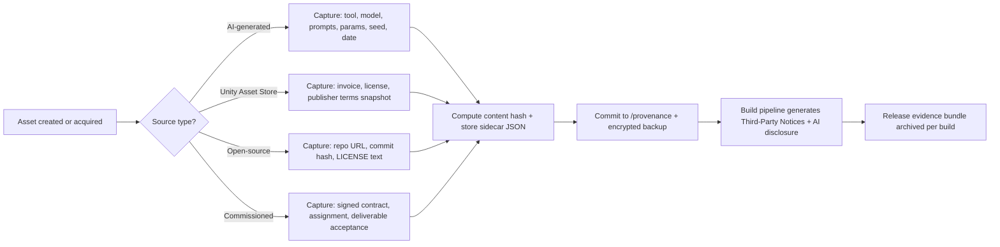
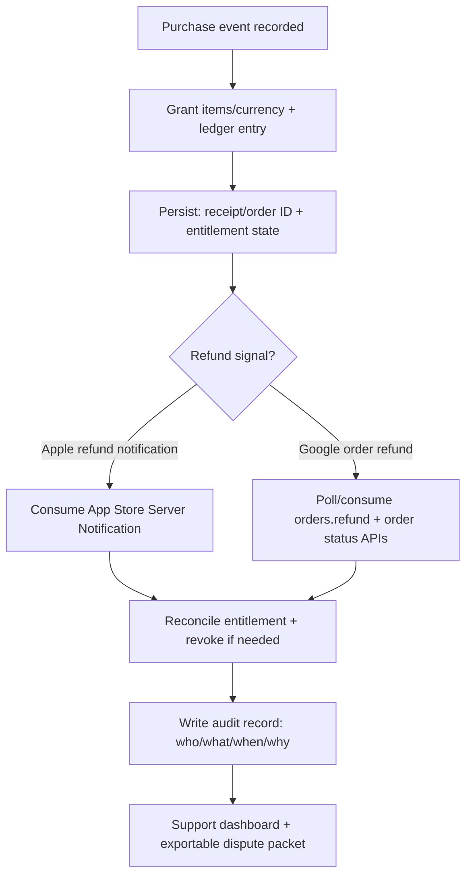

# Additional Legal and Compliance Research Roadmap for a Solo Unity Mobile Gacha RPG Using AI Assets

## Executive summary

This roadmap identifies **additional** (beyond baseline app-store/privacy/loot-box rules) legal and compliance research areas that are especially useful for a solo developer building a Unity mobile, gacha-style, turn-based co‑op PvE RPG using AI-generated assets (PixelLab and the Gemini API assumed). It is structured as an actionable backlog with deliverables, sources, and realistic effort estimates.

The **highest-priority near-term work** is concentrated in four clusters:

- **AI tool Terms-of-Service (ToS) and data handling audit**: Google’s Gemini API Additional Terms include strict **age constraints** (“18+ for API use” and prohibits using the services in apps likely accessed by under‑18 users), which can be a direct blocker if you plan to ship in-game AI generation or any Gemini API-powered runtime feature. citeturn0search1turn0search13  
- **AI copyrightability + training-data litigation risk monitoring**: US policy and case signals reinforce that *purely* AI-generated outputs may not be copyrightable without sufficient human authorship, while training-data lawsuits remain active and fact-specific; this affects IP defensibility and risk posture for AI asset pipelines. citeturn1news39turn1search0turn1search8turn1search2turn1search9  
- **Gacha compliance evidence + secure RNG auditability**: platform odds disclosure obligations exist (Apple explicitly requires odds disclosure for loot boxes), but for multi-market launch you also want robust internal evidence (banner versioning, odds snapshots, pull logging). For cryptographic integrity, ground RNG designs in recognized standards (NIST SP 800‑90A, FIPS 180‑4; optionally FIPS 140‑3-aligned key storage/HSM). citeturn0search3turn1search3turn6search4turn6search0  
- **Operational compliance automation**: refund/chargeback handling and reconciliation should be engineered early using platform signals (Apple refund notifications; Google Play order refund APIs), and retention/deletion policies should be defined in a GDPR-aligned way (storage limitation; DPIA triggers) before scaling telemetry and audit logs. citeturn3search0turn3search13turn2search5turn2search0turn2search1  

This report is **not legal advice**. It is a practical research and deliverables plan designed for legal review, engineering implementation, and platform submission readiness.

## Assumptions and framing

Assumptions (explicit, because legal conclusions depend on them):

- Distribution: iOS + Android via Apple and Google Play storefronts; monetization includes gacha/loot-box-like mechanics where paid currency or paid access can yield randomized rewards. Apple’s App Review Guidelines treat “loot boxes” as randomized paid virtual items and require odds disclosure. citeturn0search3  
- AI usage: PixelLab is used to generate or assist in generating art assets, and Gemini API is used for some combination of code generation, content ideation, or (potentially) runtime content generation. PixelLab’s ToS asserts that you “own the copyrights to your creations” and permits commercial use. citeturn0search0  
- Co-op PvE implies at least **player identifiers** (names, friend codes), and may include chat or other user-generated content (UGC). If you add chat/UGC, Google Play’s moderation expectations become a key compliance item (rules + consent + reporting/blocking). citeturn6search1turn0search14  
- Jurisdictions targeted are open-ended; you might later expand to the US/EU/UK/Japan/South Korea/China/Australia.  

Entity note (for reference only): entity["company","Google","internet services company"], entity["company","Apple","consumer electronics firm"], entity["organization","U.S. Copyright Office","us federal copyright agency"], entity["organization","National Institute of Standards and Technology","us standards agency"], entity["organization","Federal Trade Commission","us consumer protection agency"], entity["organization","World Intellectual Property Organization","un ip agency"], entity["organization","European Union","supranational union"], entity["organization","National Tax Agency","japan tax authority"], entity["organization","Australian Taxation Office","australia tax authority"], entity["organization","HM Revenue & Customs","uk tax authority"]

## Prioritized research backlog and deliverables

The table below is a **prioritized roadmap**. “Primary sources” are the first documents you should read and snapshot into your compliance repository (e.g., `/compliance/sources/` with archived PDFs/HTML exports + date captured).

### Short-term research tasks and deliverables

| Task | Purpose and key questions | Expected outputs (deliverables + format) | Recommended primary sources to consult | Est. effort (hrs) | Priority |
|---|---|---|---|---:|:---:|
| AI‑TOS‑01: Gemini API runtime feasibility audit | Determine whether you can legally ship **any** runtime feature calling the Gemini API in a consumer game that may be accessed by under‑18 users. Identify constraints: age rules, “API Client” restrictions, data handling differences between paid/unpaid, prohibited uses. | 1) “Gemini API Compliance Memo” (Markdown) summarizing do/don’t rules and design implications. 2) Architectural decision record (ADR) stating whether Gemini is “dev-only” or “runtime.” | Gemini API Additional Terms (age restrictions and API client restrictions). citeturn0search1turn0search13 | 4–8 | High |
| AI‑TOS‑02: PixelLab rights + restrictions audit | Validate commercial rights, ownership language, restrictions (e.g., “no training on outputs”), termination, warranties, liability limits, and content restrictions. | 1) “PixelLab ToS Risk Notes” (Markdown). 2) “Allowed Use Matrix” (CSV/Markdown table). | PixelLab ToS (ownership + no-training restriction). citeturn0search0 | 2–4 | High |
| AI‑DATA‑01: AI data handling policy (dev ops) | Ensure you do **not** leak sensitive or personal data into AI tools where it may be retained/reviewed; define what is allowed to paste into prompts (source code, user logs, receipts, etc.). | 1) Internal “AI Acceptable Use Policy” (Markdown). 2) Prompt redaction checklist for bug reports (Markdown). | Gemini API terms (data handling differences are material; age rules also). citeturn0search1 | 3–6 | High |
| AI‑IP‑01: Copyrightability posture + enforcement strategy | Decide how you’ll approach exclusivity and enforcement if AI outputs have uncertain copyright protection in some jurisdictions. Track key US signals (human authorship) and policy guidance. | 1) “AI Asset Copyrightability Brief” (Markdown). 2) “Enforcement decision tree” (Mermaid). | US Copyright Office AI hub and AI report (copyrightability); Supreme Court non-review leaving human-authorship stance intact (news signal but high impact). citeturn1search0turn1search8turn1news39 | 4–8 | High |
| AI‑LIT‑01: Training data litigation watchlist | Maintain a rolling watchlist for training-data lawsuits that could affect perceived risk of AI asset generation. The goal is not to litigate, but to understand evolving risk and disclosure expectations. | 1) “AI Training Data Litigation Watch” (Markdown) updated monthly. 2) Links/citations + dated snapshots of key filings/news. | Reuters coverage on major AI training-related cases. citeturn1search2turn1search9turn1search6 | 2–4 | Medium |
| ASSET‑LIC‑01: Third‑party asset license inventory | Prevent accidental license violations (Unity Asset Store, OSS libs, CC assets, fonts). Identify redistribution limits and notice requirements. | 1) “Third‑Party Inventory” (CSV) with asset source, license, proof-of-purchase, restrictions. 2) “Third‑Party Notices” screen/content (Markdown + in-game UI text). 3) CI script that fails builds if unknown licenses exist (GitHub Actions). | Unity Asset Store Terms/EULA (scope and licensor roles). citeturn5search2 | 6–12 | High |
| STORE‑POL‑01: Loot box and AI policy baseline for app submission | Lock “must-have” features for compliance: odds disclosure UX, store listing language, and (if AI/UGC is present) reporting/moderation UX. | 1) App Store / Play pre-submission checklist (Markdown). 2) Odds disclosure spec (Markdown + UI mock notes). | Apple App Review Guidelines loot box odds requirement. citeturn0search3  Google Play AI content policy and requirements (if any AI generation is user-facing). citeturn0search2turn0search14 | 4–10 | High |
| RISK‑REG‑01: Initial compliance risk register | Create a structured view of risk: likelihood, impact, mitigations, owners, evidence. Use it to prioritize engineering tasks. | 1) Risk register (CSV/Markdown). 2) “Mitigation backlog mapping” (Markdown). | NIST risk assessment guidance (structure for risk assessment). citeturn5search12turn5search8 | 3–6 | High |

### Medium-term research tasks and deliverables

| Task | Purpose and key questions | Expected outputs (deliverables + format) | Recommended primary sources to consult | Est. effort (hrs) | Priority |
|---|---|---|---|---:|:---:|
| IAP‑OPS‑01: Refund/chargeback handling design | Build reliable processes to detect refunds, reverse entitlements, and reconcile “currency spent” vs “refund granted.” Plan for customer support workflows and fraud. | 1) Refund reconciliation spec (Markdown). 2) Server webhook handlers (code) + tests. 3) Back-office reconciliation script (Python/SQL). | Apple refund notifications + App Store Server Notifications. citeturn3search0turn3search4 Google Play refund/order APIs and refund management guidance. citeturn3search13turn3search5 | 12–25 | High |
| TAX‑MAP‑01: Tax/VAT/GST mapping by market (launch planning) | Determine what taxes you must think about depending on merchant-of-record. If you only sell via in-app purchase, stores often handle collection/remittance; web shops or external payments can shift obligations. | 1) “Indirect Tax Matrix” by country (Spreadsheet). 2) “Merchant-of-record decision record” (Markdown). 3) Launch geo strategy (Markdown). | EU OSS overview (electronic services). citeturn2search7turn2search3 Japan NTA cross-border consumption tax materials. citeturn4search15turn4search0 Australia ATO GST on digital products. citeturn4search1 UK VAT rules for digital services. citeturn4search2 | 10–25 | High |
| CONTRACT‑01: Commissioned work and assignment templates | Prevent IP gaps when commissioning art/audio/code: confirm who owns what, moral rights handling where applicable, deliverables, warranties, indemnities, and AI usage disclosures. | 1) Contractor agreement template set (Markdown + DOCX). 2) “IP assignment rider” (Markdown). 3) Checklist for onboarding contractors (Markdown). | US Copyright Office “Works Made for Hire” circular; definitions guidance. citeturn5search0turn5search3 WIPO guidance on assignment/licensing. citeturn5search1turn5search11 | 12–30 | High |
| RNG‑AUDIT‑01: Secure RNG + auditability design study | Decide your technical standard for “trustworthy gacha”: CSPRNG source, deterministic audit logs, commit‑reveal option, key management/HSM needs, and what evidence you can produce in a dispute. | 1) “Gacha RNG & Auditability Spec” (Markdown). 2) RNG module (code) + security tests. 3) Proof-of-odds evidence bundle format (JSON). | NIST SP 800‑90A DRBG guidance; FIPS 180‑4 hash standard; FIPS 140‑3 cryptographic module requirements baseline. citeturn1search3turn6search4turn6search0 | 20–45 | High |
| RETENTION‑01: Recordkeeping and retention policy + automation | Define what you retain (gacha logs, odds versions, refunds, support tickets), retention duration by purpose, and deletion/archival mechanisms. | 1) Data retention schedule (Markdown). 2) Automated archival/deletion jobs (scripts + infra-as-code). 3) Evidence export “legal hold” procedure (Markdown). | GDPR storage limitation principle (data minimization + retention discipline); DPIA requirements if high risk. citeturn2search5turn2search0turn2search1 | 12–30 | High |
| DPIA‑COPPA‑01: DPIA + minors readiness plan | Decide whether you will allow minors. If yes, implement a COPPA-ready design; if no, implement age-gating and avoid child-directed signals. Create DPIA artifacts if your processing is high risk. | 1) DPIA template + completed DPIA draft (Markdown). 2) COPPA readiness checklist (Markdown). 3) Age gating spec (Markdown + UX notes). | GDPR Art. 35 DPIA. citeturn2search0turn2search1 COPPA rule (16 CFR Part 312; parental consent requirements). citeturn2search2 | 15–40 | High |
| UGC‑MOD‑01: Co-op communication and UGC compliance | If you add chat, guild names, custom profiles, or AI generation for user-visible content: implement moderation, reporting, blocking, and non-skippable acceptance of Terms of Use for UGC participation. | 1) UGC policy + community guidelines (Markdown). 2) In-app reporting + blocking UX spec (Markdown). 3) Moderation SOP and response SLAs (Markdown). | Google Play UGC moderation requirements (guidelines + consent + reporting). citeturn6search1turn0search14 Google Play Families constraints if children are in the target audience. citeturn6search2turn6search10 | 12–35 | Medium–High (depends on features) |
| INSURE‑01: Insurance and indemnity strategy research | Evaluate the practicality of insurance for IP/tech claims (e.g., media liability/E&O, cyber coverage). Determine whether you can obtain coverage as a solo dev and what evidence insurers require (security controls, license inventory). | 1) Insurance requirements brief (Markdown). 2) Broker question list (Markdown). 3) “Evidence binder” mapping what you can show (licenses, provenance logs). | Use your counsel/broker as a primary source; also cross-reference your AI/vendor and asset licenses because indemnities and exclusions hinge on contract language. (Key vendor terms: Gemini; PixelLab; Unity Asset Store.) citeturn0search1turn0search0turn5search2 | 8–20 | Medium |

### Long-term research tasks and deliverables

| Task | Purpose and key questions | Expected outputs (deliverables + format) | Recommended primary sources to consult | Est. effort (hrs) | Priority |
|---|---|---|---|---:|:---:|
| COUNSEL‑01: Counsel selection and jurisdiction plan | Determine where you need specialized counsel: loot box regulation, privacy, consumer refunds, IP clearance. Create an “engagement plan” for likely launch markets. | 1) Counsel selection criteria + RFP checklist (Markdown). 2) “Market expansion legal gate” checklist (Markdown). | Use primary statutes/regulators as the baseline set; supplement with local counsel reading lists. (Start with: GDPR text; COPPA; store policies; targeted market loot-box rules.) citeturn2search1turn2search2turn0search3 | 6–15 | Medium–High |
| PAY‑MOR‑01: Merchant-of-record options beyond app stores | If you add web shops, desktop clients, or alternative payments where permitted by local law, evaluate merchant-of-record and payment processor options and their fraud/tax handling. | 1) “Payments Architecture Options” (Markdown). 2) Compliance impact matrix (Spreadsheet). 3) Processor/vendor due diligence checklist (Markdown). | Start from platform rules on purchases and refunds; then evaluate third-party vendor terms. Apple’s StoreKit refund signals are core for reconciliation logic. citeturn3search0turn3search4 Google Play purchase management APIs. citeturn3search13 | 10–30 | Medium |
| AI‑DISC‑01: AI disclosures and store metadata hardening | Prepare for increasing store and market expectations around AI disclosures (in development and potentially in runtime). Ensure your public disclosures are accurate, consistent, and legally defensible. | 1) AI disclosure statements (store listing + in-game) (Markdown). 2) Internal evidence file naming + versioning rules (Markdown). | Google Play AI-generated content policy (if AI is user-facing) and general platform review requirements. citeturn0search2turn0search14turn0search3 | 6–15 | Medium |
| AI‑PROV‑02: Training-data provenance stress test | For high-value assets (key character, logo, main theme), run enhanced provenance checks: similarity scanning, manual review, and “re-generation with constraints” to reduce derivative risk. | 1) “High-value asset clearance checklist” (Markdown). 2) Evidence pack per key asset (ZIP: prompts, steps, edits, hashes). | US Copyright Office AI materials (re: human authorship and disclosure), plus ongoing litigation watch items to update your risk assumptions. citeturn1search0turn1search8turn1search2 | 15–40 | Medium |
| LOOT‑GEO‑01: Deep market-by-market gacha compliance | For each target market, produce a “launch gate” compliance memo (odds, disclosures, recordkeeping, minors constraints). | 1) Country compliance memos (Markdown). 2) Localization checklist for odds and consumer disclosures (Markdown). 3) Store listing compliance diff by locale (Spreadsheet). | Start with platform odds requirements (Apple) as global baseline. citeturn0search3 Then consult market primary rules where applicable (e.g., retention rules and reporting duties in stricter markets—create a captured archive per regulator). | 25–80 | Medium–High (depends on expansion) |
| INCIDENT‑01: Data breach and complaint response playbooks | Define response procedures for data incidents and regulatory/user complaints; align with retention policy and support workflows. | 1) Incident response SOP (Markdown). 2) Evidence preservation procedure (Markdown). 3) Support escalation scripts (Markdown). | Ground this in GDPR “risk” framing and your DPIA outcomes; cite GDPR. citeturn2search1turn2search0 | 12–30 | Medium |
| RISK‑REG‑02: Mature risk register + quarterly review | Transform the risk register into a living governance tool with quarterly reviews, evidence links, and mitigations tracked to engineering tickets. | 1) Risk register v2 (Spreadsheet). 2) Quarterly compliance review template (Markdown). | NIST risk assessment structure as an organizing foundation. citeturn5search12 | 6–12 / quarter | Medium |

## Automation-first evidence workflows

A solo developer’s sustainable compliance strategy is **automation + evidence capture**, not manual checklists. The following workflows convert “legal requirements” into tangible CI artifacts.

### Asset provenance capture pipeline (AI + third‑party)



**Deliverable format suggestion (sidecar JSON per asset):**
```json
{
  "asset_id": "ui_button_primary_v03",
  "type": "image",
  "source": "AI",
  "tool": "PixelLab",
  "model_or_mode": "unknown",
  "created_at_utc": "2026-03-06T22:11:00Z",
  "prompts": ["..."],
  "seed": "12345",
  "post_edit_tools": ["Photoshop", "Aseprite"],
  "human_edits_summary": "Repaint edges; changed icon silhouette; adjusted colors",
  "sha256": "..."
}
```

This is particularly valuable because: (a) PixelLab imposes restrictions (e.g., no training on generated images unless explicitly permitted), and (b) Gemini imposes strict constraints on use in apps accessible by under‑18 users, making clean separation between “dev-only generation” and “runtime generation” evidentiary and architectural. citeturn0search0turn0search1  

### Refund/chargeback reconciliation workflow (platform-native)



This workflow is based on: Apple’s refund notifications and server notifications for refunds, and Google Play’s purchase management and refund capabilities (including APIs to refund orders). citeturn3search0turn3search4turn3search13turn3search5  

### Secure RNG and cryptographic auditability workflow

For gacha integrity, the goal is not “prove randomness to players” (usually not required) but to **prove consistency** between disclosed odds and realized outcomes, and detect tampering.

```mermaid
flowchart LR
  A[Banner config versioned] --> B[Odds snapshot hashed (SHA-256)]
  B --> C[Hash stored with banner version + release tag]
  C --> D[Server RNG generates pulls]
  D --> E[Log pull: banner_version, odds_hash, result, timestamp]
  E --> F[Archival + retention job]
  F --> G[Audit export: reproduce odds disclosure + sample pull evidence]
```

Using SHA‑256 (or similar) is anchored in NIST’s Secure Hash Standard (FIPS 180‑4). citeturn6search4  
For RNG generation, NIST SP 800‑90A is a widely cited foundation for deterministic random bit generation mechanisms (DRBG). citeturn1search3  
If you later use dedicated key storage or HSM-backed systems, FIPS 140‑3 is a common baseline reference for cryptographic modules. citeturn6search0  

## Risk register structure and example entries

A good risk register is a **ranking system** and a **deliverables tracker**. A workable shape is adapted from standard risk assessment guidance (e.g., NIST SP 800‑30’s emphasis on identifying, evaluating, and responding to risks). citeturn5search12  

### Suggested risk register schema (CSV/Spreadsheet)

Columns:
- `Risk_ID`
- `Category` (AI ToS, IP, Loot/Gacha, Privacy, Payments, Tax, UGC Moderation, Security)
- `Statement` (what can go wrong)
- `Likelihood` (Low/Med/High)
- `Impact` (Low/Med/High)
- `Risk_score` (simple numeric)
- `Mitigation_controls` (engineering + legal)
- `Evidence_links` (paths in repo, policy snapshots, test results)
- `Owner`
- `Review_date`

### Example entries (illustrative)

| Risk_ID | Statement | Likelihood | Impact | Mitigation controls | Evidence |
|---|---|---:|---:|---|---|
| AI‑AGE‑001 | Gemini API use in a consumer mobile game violates age/API client restrictions if the game is likely accessed by under‑18 users. citeturn0search1 | Med | High | Keep Gemini “dev-only”; no runtime API calls; ADR documenting separation; remove any in-game AI generation. | `/compliance/adr/gemini-dev-only.md` |
| IP‑AI‑002 | AI-generated key art is not copyrightable or weakly enforceable in some jurisdictions absent sufficient human authorship; reduces ability to stop copycats. citeturn1news39turn1search8 | Med | Med | Maintain provenance; perform substantial human edits; document authorship; consider commissioning hero assets. | `/provenance/...` |
| PAY‑REF‑003 | Refunds/chargebacks cause “net-negative” currency if entitlements are not revoked correctly. citeturn3search0turn3search13 | High | High | Automated refund handlers; ledger; reconciliation jobs; support tooling. | `/ops/refunds/` |

## Appendix: primary sources to monitor and LLM prompt templates

### Primary sources to prioritize (snapshot into your compliance repo)

AI tool terms and restrictions:
- Gemini API Additional Terms (age restrictions; API client restrictions). citeturn0search1turn0search13  
- PixelLab Terms of Service (ownership claim; non-training restriction). citeturn0search0  

Copyright, AI policy, and case signals:
- U.S. Copyright Office AI hub + AI copyrightability report. citeturn1search0turn1search8  
- Supreme Court non-review signal reinforcing “human authorship” standard in the US (news source; monitor for future changes). citeturn1news39  

Platform policy sources impacting gacha and AI:
- Apple App Review Guidelines (loot box odds disclosure; other monetization constraints). citeturn0search3  
- Google Play AI-generated content policy and requirements (reporting/flagging if AI generates user-visible content). citeturn0search2turn0search14  
- Google Play UGC moderation expectations if you add chat/UGC (guidelines, consent, reporting, blocking). citeturn6search1  
- Google Play Families policy if any target audience includes children. citeturn6search2  

Privacy/age laws:
- GDPR consolidated text; DPIA requirement under Article 35; retention discipline under Article 5. citeturn2search1turn2search0turn2search5  
- COPPA rule text (16 CFR Part 312) and parental consent requirements. citeturn2search2  

Refund and payment operations:
- Apple refund notifications and server notifications. citeturn3search0turn3search4  
- Google Play purchase management/refund APIs and Play Console refund operations. citeturn3search13turn3search5  

Tax/VAT/GST (launch planning, especially if you add web store payments):
- EU VAT OSS overview. citeturn2search7  
- Japan NTA cross-border consumption tax resources. citeturn4search15turn4search0  
- Australia ATO GST on imported services and digital products. citeturn4search1  
- UK VAT rules for digital services. citeturn4search2  

Security/RNG standards:
- NIST SP 800‑90A (DRBG). citeturn1search3  
- FIPS 180‑4 (Secure Hash Standard). citeturn6search4  
- FIPS 140‑3 (cryptographic modules baseline). citeturn6search0  

Work-for-hire and licensing fundamentals (contract template grounding):
- US Copyright Office Circular 30 (works made for hire). citeturn5search0  
- WIPO assignment and licensing overview. citeturn5search1turn5search11  

### Sample prompts for legal and technical LLM research

Use LLM outputs as *drafting aids*; always verify against the primary sources above.

**Prompt: Gemini API compliance decision**
```text
You are a compliance analyst. Read the Gemini API Additional Terms of Service and extract:
1) age requirements and restrictions on using the API in consumer apps,
2) data use differences between paid vs unpaid usage,
3) restrictions relevant to a mobile game,
4) a recommended “dev-only vs runtime” decision with rationale.
Output as a concise Markdown memo plus a checklist for engineers.
```

**Prompt: PixelLab ToS obligations**
```text
Extract from PixelLab Terms of Service:
- ownership/output rights language,
- restrictions (especially training on outputs),
- termination and risk items (warranties/limitations),
- any attribution or disclosure-related requirements.
Provide a “do/don’t” matrix for a commercial mobile game pipeline.
```

**Prompt: Contract clause drafting for commissioned art**
```text
Draft clauses for a contractor agreement for game art/audio:
- assignment of IP,
- work-made-for-hire language (if applicable),
- moral rights waiver (where enforceable),
- warranty of originality + no infringement,
- disclosure of any AI assistance and tool restrictions,
- indemnity and limitation-of-liability placeholders.
Output in Markdown, annotated with “jurisdiction-specific; counsel review needed”.
```

**Prompt: RNG audit design**
```text
Design a gacha RNG auditability system:
- server-side RNG generation,
- banner versioning and odds hashing,
- pull logging schema,
- commit-reveal option for tamper-evidence,
- retention and export for disputes.
Reference NIST SP 800-90A and FIPS 180-4 for primitives.
Provide: SQL schema, JSON event format, and a Mermaid workflow diagram.
```

**Prompt: DPIA starter**
```text
Given a Unity mobile game with accounts, analytics, purchases, and co-op features,
produce a DPIA draft baseline:
- processing purposes,
- data categories,
- risk assessment,
- mitigations,
- retention schedule,
- user rights handling.
Output in Markdown with placeholders for region-specific legal review.
```

