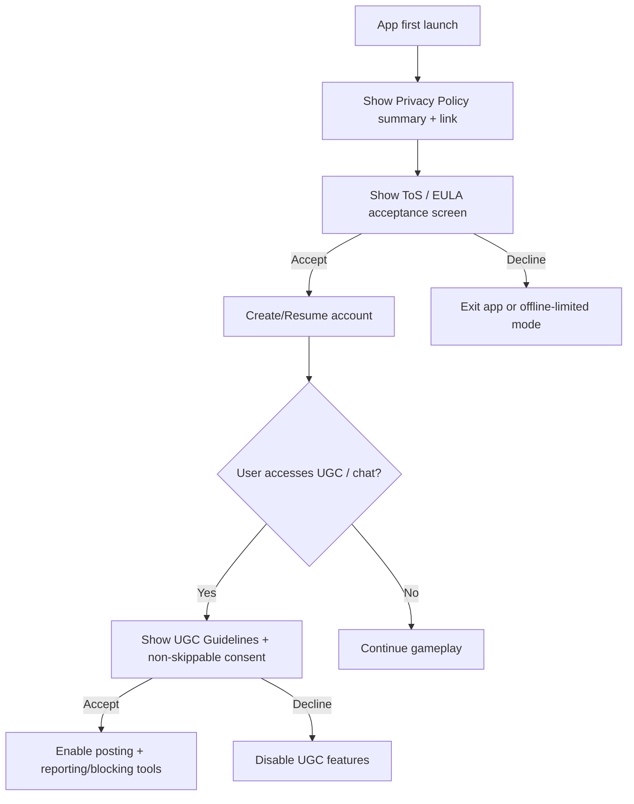
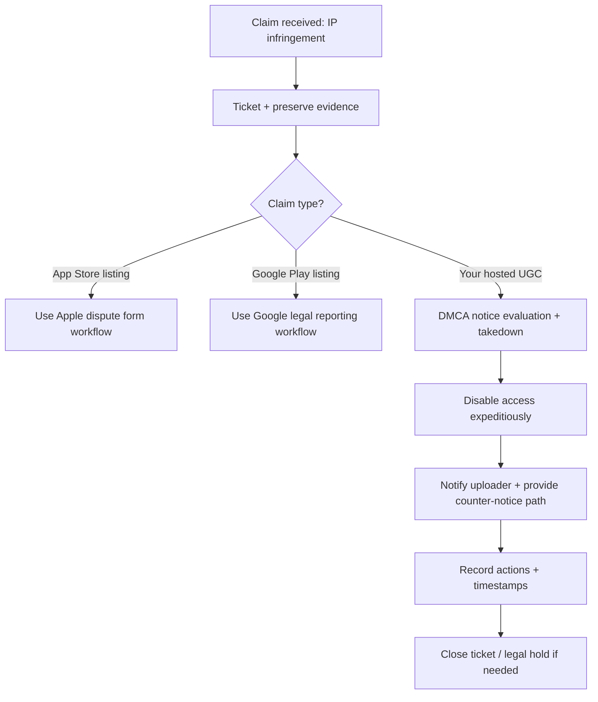

# Drafting Terms of Service, EULA, and User-Facing Legal Documents for a Unity Mobile Gacha RPG Using AI Assets

## Executive summary

This report proposes a **practical, engineering-aligned document set** and implementation plan for a solo developer shipping a Unity-built mobile gacha RPG (turn-based, co‑op PvE) on iOS/Android while using AI-assisted assets (PixelLab; Google Gemini API assumed). It is **not legal advice**; it is a structured research-based blueprint intended to be reviewed and adapted with qualified counsel.

The most important “non-obvious” constraint to resolve early is whether **any runtime feature** will call the Gemini API: Google’s Gemini API Additional Terms include an explicit requirement that you **must be 18+ to use the APIs** and that you **will not use the services in an application “directed towards or likely to be accessed by individuals under 18.”** citeturn0search3 This can conflict with common mobile game rating/target-audience patterns; for many games, the safest posture is **Gemini for development only** (no in-game calls), and reflect that in your disclosures and internal compliance evidence.

On the store side, you should treat odds disclosure and transparency as both **a legal text problem** and **a product feature**. Apple’s App Review Guidelines require apps offering loot boxes / randomized paid virtual items to disclose odds before purchase. citeturn0search12 Google Play’s Payments policy similarly requires that apps offering randomized virtual items from a purchase disclose odds near the purchase interaction. citeturn0search1 In parallel, some jurisdictions add additional constraints (for example, China’s 2016 ministry notice requires probability disclosures, publishing random-draw results, and keeping records ≥90 days, plus providing alternative acquisition methods). citeturn6search0

Operationally, your legal documents should be engineered as **versioned artifacts with acceptance logging**, not static PDFs. Google Play’s user-generated content guidance explicitly expects Terms of Use (separate from privacy policy) and non-skippable consent to those guidelines before users engage with UGC. citeturn3search0turn3search12 If you ever allow AI-generated user-visible content, Google Play’s AI-Generated Content policy expects in-app reporting/flagging mechanisms and responsive moderation. citeturn0search10turn0search2

## Document set and governance model

### Recommended document set

Below is a recommended “minimum viable” legal document package for a mobile gachapon RPG with optional online/co‑op features and AI-assisted development. Whether you need each item depends on your feature flags (UGC, guild chat, web shop, ad tracking, etc.), but designing the scaffolding early reduces rework.

Apple structure note: Apple provides a **Standard EULA** for apps distributed via the App Store; you can optionally provide a **Custom EULA** in App Store Connect (and manage EULA via API). If you do not provide a custom EULA, the standard EULA applies and the license agreement link is not shown on your App Store product page. citeturn2search0turn2search4

Google Play structure note: Google Play explicitly requires a privacy policy for apps that handle user data; the policy must explain what data is collected/transmitted, how it is used, and sharing. citeturn2search6 Google Play also requires a “Data safety” disclosure section in the store listing describing data collection/sharing/handling practices. citeturn2search2

### Governance attributes you should decide upfront

Treat each user-facing legal document as a **versioned product dependency** with explicit governance:

| Attribute | Recommendation | Why it matters |
|---|---|---|
| Document owner | “Application Provider” (you/your studio legal name) as the publisher of ToS/EULA/Privacy | Store disputes and DMCA notices are routed to the rights holder / provider, and mismatched identity creates friction |
| Canonical format | Markdown in repo → generate HTML for web + in-app viewer | Enables diffing, reviews, and CI enforcement |
| Versioning | Semantic version (`v1.2.0`) + immutable build hash | Enables “what did user accept?” proof |
| Update notice period | Define a standard notice window (e.g., 15–30 days for material changes), plus immediate applicability for security/legal obligations | Minimizes consumer protection risk; supports defensibility |
| Acceptance method | Clickwrap consent on first launch / account creation; re-consent for material updates; feature-gated consent for UGC, tracking, AI generation | Google’s UGC policy expects Terms of Use consent before engaging with UGC. citeturn3search0turn3search12 |
| Acceptance logging | Server-side log: user ID, doc ID, version, timestamp, locale, device platform, IP (if collected), and consent payload | Critical for disputes, audits, and market compliance |
| Retention | Define retention per purpose (fraud, chargebacks, regulatory evidence) and enforce deletion/archival | GDPR storage limitation principle expects retention discipline. citeturn1search5 |
| Localization | Maintain localized versions for key markets; track which version user accepted | Prevents “unfair terms” allegations due to unreadable language |
| Enforcement contact | Dedicated email + in-app support flow for legal/privacy claims | Helps respond quickly to platform inquiries and user complaints |
| Evidence snapshots | Archive external terms (PixelLab, Gemini API, Unity Asset Store, etc.) per release | Proves what obligations applied at the time of creation/distribution |

### Document list with purpose and where it lives

| Document | Purpose | Where published | Usually requires acceptance? |
|---|---|---|---|
| App EULA (Apple Standard or Custom EULA) | License to use the app; device/platform usage constraints | App Store listing link (if custom) + in-app “Legal” | Apple enforces Standard/Custom EULA acceptance as part of app licensing. citeturn2search4turn2search0 |
| Terms of Service (ToS) | Governs online services (accounts, co-op match, servers), conduct, bans, virtual goods terms, dispute process | Web + in-app | Yes (clickwrap at account creation or first launch) |
| Privacy Policy | GDPR/COPPA readiness, disclosures, sharing, retention, user rights, contact | Web + in-app; required by Google Play user data policy | Not always “acceptance,” but must be presented and referenced. citeturn2search6turn2search2 |
| Refund / Chargeback Policy | Clarifies store-controlled refunds, reversals, and in-game currency adjustment | Web + in-app support area | Recommended (especially with gacha) |
| Credits / Third‑Party Notices | License compliance (OSS, Unity Asset Store obligations, CC assets), attribution | In-app menu; optionally web | No, but must be accessible |
| AI-Use Disclosure | Transparency about AI-assisted development and/or runtime AI features; sets expectations about uniqueness | In-app legal + store listing text (as appropriate) | Recommended (esp. for markets/policies sensitive to AI content) |
| Age / Eligibility Policy | Eligibility, minors handling, parental consent approach (if applicable) | ToS + in-app gating screen | Yes (gate or consent flow) |
| Tracking / Cookie Notice | For website; for in-app tracking, ATT process and disclosures | Web; in-app if you collect tracking IDs | Consent may be required depending on tracking scope |
| DMCA / IP Takedown Procedure | How to submit claims; designated agent if you host UGC; response timeline | Web | No, but must be published if you want safe harbor posture |
| Data Processing Addendum (DPA) | Only if you process personal data for business customers as a “processor” (B2B). Otherwise you’ll sign DPAs *with* your vendors as controller | Contract pack (B2B) | N/A (contractual) |

GDPR note: Processor contracts are governed by GDPR Article 28; if you are a controller using processors (hosting, analytics), you typically need DPAs **with those processors**; you generally do not provide a DPA to end users (they get a privacy policy). citeturn3search2turn3search18

## Clause-to-feature mapping

The main drafting mistake in game legal docs is writing generic ToS text that is not aligned to product behaviors. Below is a mapping from core features → clauses → evidence/logging you should build.

### Feature-to-clause matrix

| Feature / subsystem | Clauses typically required | Implementation hooks / evidence |
|---|---|---|
| Accounts and authentication | Eligibility/age, account security, termination and bans, limitation of liability | ToS acceptance logging; ban reasons; appeal workflow |
| Gacha / loot-box mechanics | Odds disclosure reference, “no cash value,” fairness & auditability statement, refund reversal handling | In-game odds UI; banner/version logs; pull audit logs; customer support exports |
| In-app purchases (IAP) | Store terms precedence, refund/chargeback policy, entitlement revocation, taxes/fees disclaimers | Receipt IDs; refund notifications; ledger and reconciliation scripts |
| Co-op PvE (matchmaking, coordination) | Service availability disclaimers, latency responsibility limits, conduct rules, anti-cheat clause | Match logs; anti-abuse enforcement records |
| UGC / chat (if added) | Content rules, reporting/blocking mechanisms, moderation policy, consent gating before posting, repeat infringer policy | Required in-app reporting/blocking UX; ToU acceptance gating; moderation audit logs citeturn3search0turn3search12 |
| AI generation in-app (if you do it) | AI policy, prohibited content, reporting/flagging, moderation actions, retention of prompts/outputs | In-app reporting requirement for AI-generated content per Google Play; prompt/output logs; filters citeturn0search10turn0search2 |
| AI-assisted development (no runtime AI) | AI-use disclosure, non-exclusivity statement, third-party tool terms compliance statement | Asset provenance ledger; snapshot of PixelLab/Gemini terms at release citeturn1search0turn0search3 |
| Analytics / tracking / ads | Privacy policy disclosures; ATT permission where tracking applies; data safety disclosures | ATT prompt integration and App Store privacy requirements; Data safety store form citeturn2search1turn2search9turn2search2 |
| EU market launch | GDPR rights, lawful basis, retention, DPIA triggers, processor contracts and subprocessors | DPIA template; retention schedule; vendor DPAs citeturn1search5turn1search1turn3search2 |
| US minors exposure | COPPA policy posture (if under‑13); parental consent plan; data minimization | Age gate; parental consent workflow if needed citeturn1search2turn1search10 |

### Non-negotiable compliance constraints to reconcile in product design

- **Gemini API age restriction**: you should not deploy Gemini API calls in a consumer application that is likely accessed by under‑18 users. If you want to ship runtime AI features, your ToS/age gating would need to reflect this—and likely materially affect your addressable market. citeturn0search3  
- **UGC requires “cannot be skipped” consent to Terms of Use** under Google Play UGC guidance; your UI must gate content posting/access until consent is captured. citeturn3search0turn3search12  
- **Loot box odds disclosure** is required by Apple for randomized paid virtual items. citeturn0search12  

## Clause library with sample snippets

The snippets below are **starting points** for counsel review. Do not ship them verbatim without tailoring to your product behavior, country rollout, and business identity.

### License grant and scope (EULA core)

```text
License Grant. Subject to your compliance with this Agreement, we grant you a limited,
personal, non-exclusive, non-transferable, revocable license to install and use the App
for your personal, non-commercial entertainment purposes on devices you own or control,
as permitted by applicable platform terms.
```

Apple note: if you do not provide a custom EULA, Apple’s Standard EULA governs the app license relationship for App Store distribution. citeturn2search0turn2search4

### Virtual currency / virtual items and “no real-world value”

```text
Virtual Items. The App may include virtual currency and virtual items (“Virtual Items”).
Virtual Items are licensed, not sold. Virtual Items have no real-world monetary value,
are non-refundable except as required by law or platform policy, and cannot be exchanged
for cash or cash equivalents.
```

### Gacha / loot box odds disclosure clause

```text
Randomized Rewards; Odds Disclosure. The App includes randomized rewards (e.g., gacha / loot boxes).
Where a purchase (directly or via paid virtual currency) provides randomized rewards, the probability
(odds) of receiving reward categories or items is disclosed in-app prior to the purchase and is accessible
from the relevant banner / draw screen.
```

Apple requires this disclosure for loot box mechanisms. citeturn0search12  
Google Play similarly requires odds disclosure for randomized virtual items from a purchase. citeturn0search1

### Refund and chargeback clause (store-controlled)

```text
Purchases; Refunds. Purchases are processed by the platform provider (e.g., Apple or Google).
Refund eligibility and processing are determined by the platform’s rules and your statutory rights.
If a refund is granted, we may, where technically feasible and consistent with platform rules, remove
or adjust the associated Virtual Items or benefits to reflect the refunded transaction.
```

Operationally, Apple provides refund notification mechanisms and server notification flows for refunds, enabling entitlement adjustments when refunds are granted. citeturn2search0turn2search4

### AI-generated / AI-assisted content clause (development use)

```text
AI-Assisted Assets. Certain in-game assets may have been created with the assistance of generative AI tools
and subsequently edited or curated by the developer. Because generative outputs may not be exclusive, we do
not represent that any AI-assisted asset is unique or will not resemble content created independently by others.
```

Why this clause matters: US copyrightability standards emphasize human authorship, and policy guidance notes that merely providing prompts may not be sufficient for copyrightability of AI-generated outputs; this affects how confidently you can claim exclusivity. citeturn1search3turn1search7turn1search15

### AI tool restrictions clause (PixelLab and Gemini constraints)

```text
Third-Party AI Tools. We use third-party AI tools to assist development. Use of such tools is subject to the
tools’ terms. Where applicable, we will not use generated outputs in ways prohibited by those terms.
```

PixelLab’s terms state you own copyrights to your creations and allow commercial use, but also prohibit using PixelLab to train your own models on generated images unless explicitly permitted in writing. citeturn1search0  
Gemini API terms include strict age and “API client” restrictions (see eligibility clauses below). citeturn0search3

### Eligibility and age-gating clause (with Gemini API consideration)

If you **do not** ship runtime Gemini API features, keep an ordinary age/eligibility clause:

```text
Eligibility. You must be at least 13 years old to use the App. If you are under the age of majority
where you live, you represent that you have your parent or guardian’s permission to use the App and
to make purchases where permitted.
```

If you **do** ship runtime Gemini API features (high-risk), you may need an “18+ only” posture consistent with Gemini API terms:

```text
18+ Requirement for AI Features. Certain features may rely on third-party AI services that require users
to be at least 18 years old. If you are under 18, you may not access those features. We may require age
verification or disable features in regions or accounts where compliance cannot be assured.
```

Gemini API Additional Terms: “You must be 18 years of age or older to use the APIs” and you will not use the services in API clients likely accessed by under‑18 individuals. citeturn0search3

### UGC terms and moderation clause (only if you have chat/guild posts/custom names)

```text
User Content and Conduct. If the App allows you to post or share content (e.g., chat messages, usernames,
guild descriptions), you agree not to post unlawful, infringing, harassing, hateful, sexually explicit, or otherwise
objectionable content. We may remove content, restrict access, or suspend accounts for violations.

Reporting and Blocking. The App provides in-app tools to report and block objectionable content and users.
We review reports and take action as appropriate.
```

Google Play UGC policy expects: user guidelines before engagement, user consent to guidelines (Terms of Use), and in-app reporting/blocking with reasonable moderation. citeturn3search0turn3search12

### Limitation of liability and disclaimers

```text
Disclaimer. THE APP IS PROVIDED “AS IS” AND “AS AVAILABLE.” TO THE MAXIMUM EXTENT PERMITTED BY LAW,
WE DISCLAIM ALL WARRANTIES, EXPRESS OR IMPLIED, INCLUDING IMPLIED WARRANTIES OF MERCHANTABILITY,
FITNESS FOR A PARTICULAR PURPOSE, AND NON-INFRINGEMENT.

Limitation of Liability. TO THE MAXIMUM EXTENT PERMITTED BY LAW, IN NO EVENT WILL WE BE LIABLE FOR ANY
INDIRECT, INCIDENTAL, SPECIAL, CONSEQUENTIAL, OR PUNITIVE DAMAGES, OR FOR ANY LOSS OF PROFITS OR DATA,
ARISING OUT OF OR RELATING TO THE APP OR THESE TERMS.
```

### Arbitration / venue clause (US-oriented; counsel review required)

```text
Governing Law; Venue. These Terms are governed by the laws of [State/Country], without regard to conflict
of laws principles. Except where prohibited by law, disputes will be resolved exclusively in the state or federal
courts located in [County/State/Country], and you consent to personal jurisdiction there.
```

### Data retention clause (GDPR-aligned concept)

```text
Data Retention. We retain personal data only as long as necessary for the purposes described in the Privacy Policy,
including fraud prevention, security, dispute resolution, and legal compliance. We may retain transaction and audit logs
for longer periods where required by law or reasonably necessary to resolve disputes.
```

GDPR’s principles include storage limitation and purpose limitation; DPIAs are required where processing is likely to result in high risk to rights and freedoms (often triggered by new technologies, profiling, or sensitive data usage). citeturn1search5turn1search1

## Store, market, and localization requirements

### Apple App Store and Google Play constraints you must reflect in docs and UI

**EULA delivery (Apple)**  
- Apple provides a Standard EULA and lets you provide a Custom EULA in App Store Connect; if you do not provide one, the standard applies and the license agreement link is not shown on your App Store product page. citeturn2search0turn2search4  
Practical implication: if you rely only on Apple’s Standard EULA, you still likely need a ToS for online services (accounts, co-op, gacha economy). Keep them consistent.

**Privacy policy and disclosure (Google Play)**  
- Google Play’s User Data policy requires posting a privacy policy explaining data collection/transmission/use and sharing. citeturn2search6  
- Google Play listings include a Data safety section describing data practices. citeturn2search2  

**Odds disclosure (Apple + Google Play)**  
- Apple: loot box odds disclosure required prior to purchase. citeturn0search12  
- Google Play: disclose odds for randomized virtual items received from a purchase. citeturn0search1  

**UGC moderation requirements (Google Play)**  
- If you have UGC (chat, guild posts, etc.), Google Play expects published guidelines, non-skippable consent to Terms of Use, and in-app reporting/blocking plus appropriate moderation. citeturn3search0turn3search12  

**AI-generated content policy (Google Play)**  
- If your app generates content using AI (user-visible outputs), Google Play expects in-app user reporting/flagging of offensive content without exiting the app, and using reports to inform filtering/moderation. citeturn0search10turn0search2  

### Jurisdictional considerations you should design for

This section is intentionally pragmatic: it identifies the “document and logging deltas” you’ll likely need if you expand into specific markets.

**United States (baseline)**
- COPPA triggers if your online service is directed to children under 13 or if you have actual knowledge you collect personal information from a child under 13; the COPPA Rule is codified at 16 CFR Part 312. citeturn1search2turn1search10  
Implementation implication: decide your under‑13 posture and ensure ToS + privacy + gating matches it.

**European Union (GDPR)**
- GDPR requires governance over processing; DPIA requirement appears in Article 35 when processing is likely to result in high risk. citeturn1search1turn1search5  
- Processor contracts are governed by Article 28 (your vendor DPAs should map to this). citeturn3search2turn3search18  
Implementation implication: keep consent logs, retention policy, and vendor DPAs ready; treat analytics and behavioral profiling carefully.

**United Kingdom**
- UK approach includes UK GDPR + consumer protection and advertising enforcement dynamics. A major current driver is the UK Advertising Standards Authority enforcement notice on loot box disclosures in app stores (active monitoring beginning May 26, 2026). citeturn4search3  
Implementation implication: include loot box presence disclosure in store listing copy, not only in deep-scroll text.

**Japan**
- Japan’s Act against Unjustifiable Premiums and Misleading Representations aims to prevent inducement of customers by unjustifiable premiums and misleading representations in transactions of goods/services. citeturn7search0turn7search6  
Implementation implication: gacha banner descriptions, odds disclosures, “guarantees,” and marketing claims should be vetted for misleading representation risk, and you should carefully document how pity/guarantees operate.

**South Korea**
- South Korea’s Game Industry Promotion Act provides a statutory foundation, and market enforcement since 2024 has focused on probabilistic item probability disclosure practices (practical compliance expectations are often interpreted via guidance and enforcement posture). citeturn4search4turn4search0  
Implementation implication: prepare Korean-language probabilistic item disclosures and ensure your odds UI is clear and consistent.

**China**
- China’s 2016 Ministry notice includes multiple constraints relevant to gacha: disclose probabilistic draw outcomes and probabilities; publish random draw results; keep records for government inquiry for at least **90 days**; and provide alternative acquisition methods for items/services of equivalent performance. citeturn6search0  
Implementation implication: your ToS + in-game odds / results publication + retention logging must be designed if China is a target.

**Australia**
- Australia’s government classification guidance indicates that from Sept 22, 2024, games with in-game purchases linked to elements of chance (paid loot boxes) receive minimum classification outcomes (e.g., “M”), and simulated gambling content is restricted to adults (“R 18+”). citeturn4search6turn4search2  
Implementation implication: monetization design affects classification; align your target audience, rating, and eligible features.

## Operational implementation: consent logging, retention, and automation

### Consent and acceptance logging model

You want a “provable chain” that answers: **what** did the user accept, **when**, **in what language**, and **how** did you present it?

A typical consent flow (with UGC gating) aligned to Google Play UGC expectations:



Google Play UGC guidance emphasizes user guidelines before engagement and non-skippable consent to those guidelines (Terms of Use), plus reporting/blocking tools and moderation. citeturn3search0turn3search12

### Privacy and retention scaffolding (SQL)

Below is a **minimal** schema to support: document versions, acceptance records, and retention actions. Keep it separate from gameplay tables to simplify privacy requests and legal holds.

```sql
-- Legal documents registry
CREATE TABLE legal_document (
  doc_id            TEXT PRIMARY KEY,     -- e.g., "tos", "privacy", "eula", "ugc_terms"
  title             TEXT NOT NULL,
  owner_legal_name  TEXT NOT NULL,
  contact_email     TEXT NOT NULL,
  created_at_utc    TIMESTAMP NOT NULL DEFAULT CURRENT_TIMESTAMP
);

-- Versioned document artifacts
CREATE TABLE legal_document_version (
  doc_id            TEXT NOT NULL REFERENCES legal_document(doc_id),
  version           TEXT NOT NULL,         -- e.g., "1.2.0"
  locale            TEXT NOT NULL,         -- e.g., "en-US", "ja-JP"
  published_at_utc  TIMESTAMP NOT NULL,
  effective_at_utc  TIMESTAMP NOT NULL,
  sha256            TEXT NOT NULL,         -- hash of canonical HTML/Markdown
  storage_uri       TEXT NOT NULL,         -- where the rendered file lives
  is_material_change BOOLEAN NOT NULL DEFAULT FALSE,
  PRIMARY KEY (doc_id, version, locale)
);

-- User acceptance log (clickwrap)
CREATE TABLE legal_acceptance_event (
  acceptance_id     TEXT PRIMARY KEY,      -- ULID/UUID
  user_id           TEXT NOT NULL,
  doc_id            TEXT NOT NULL,
  version           TEXT NOT NULL,
  locale            TEXT NOT NULL,
  accepted_at_utc   TIMESTAMP NOT NULL,
  client_platform   TEXT NOT NULL,         -- ios/android
  client_version    TEXT NOT NULL,
  ip_address        TEXT,                  -- optional; consider privacy posture
  user_agent        TEXT,                  -- optional
  FOREIGN KEY (doc_id, version, locale)
    REFERENCES legal_document_version(doc_id, version, locale)
);

-- Data retention actions (for auditability)
CREATE TABLE retention_action_log (
  action_id         TEXT PRIMARY KEY,
  action_type       TEXT NOT NULL,         -- "DELETE", "ARCHIVE", "LEGAL_HOLD"
  subject_type      TEXT NOT NULL,         -- "USER", "EVENT_LOG", etc.
  subject_id        TEXT NOT NULL,
  reason            TEXT NOT NULL,
  executed_at_utc   TIMESTAMP NOT NULL DEFAULT CURRENT_TIMESTAMP
);
```

Retention discipline is particularly important under GDPR principles (storage limitation) and when DPIAs are required for higher-risk processing. citeturn1search5turn1search1

### Sample API endpoints for acceptance and consent logging

A minimal REST contract for server-side logging (useful even if you are “offline-first”):

```json
{
  "openapi": "3.0.0",
  "info": { "title": "Legal Acceptance API", "version": "1.0.0" },
  "paths": {
    "/v1/legal/latest": {
      "get": {
        "summary": "Get latest legal doc versions for a locale",
        "parameters": [{ "name": "locale", "in": "query", "required": true, "schema": { "type": "string" } }],
        "responses": { "200": { "description": "Latest doc versions and URIs" } }
      }
    },
    "/v1/legal/accept": {
      "post": {
        "summary": "Record user acceptance of a legal document version",
        "requestBody": {
          "required": true,
          "content": {
            "application/json": {
              "schema": {
                "type": "object",
                "required": ["docId","version","locale","acceptedAtUtc","clientPlatform","clientVersion"],
                "properties": {
                  "docId": { "type": "string" },
                  "version": { "type": "string" },
                  "locale": { "type": "string" },
                  "acceptedAtUtc": { "type": "string", "format": "date-time" },
                  "clientPlatform": { "type": "string" },
                  "clientVersion": { "type": "string" }
                }
              }
            }
          }
        },
        "responses": { "200": { "description": "Accepted" } }
      }
    }
  }
}
```

### DMCA / IP takedown handling as an operational workflow

If you host UGC or community content, a DMCA-safe-harbor posture in the US typically requires designating a DMCA agent and publishing contact info. The U.S. Copyright Office maintains a DMCA Designated Agent Directory and provides resources on Section 512. citeturn2search3turn2search7turn2search19

A practical internal workflow:



Apple provides IP dispute and copyright infringement claim forms for App Store content. citeturn3search3turn3search11turn3search7  
For your own services, the Copyright Office’s resources explain agent designation and safe harbor conditions. citeturn2search7turn2search3

### CI automation: snapshot legal docs and third-party terms

You should snapshot:
- your own rendered ToS/Privacy/EULA pages,
- external terms you rely on (PixelLab, Gemini API terms, Unity Asset Store terms, etc.),
- store policy pages significant to your app (loot box odds disclosure, UGC, AI content).

Example GitHub Actions snippet (`ci-snapshot.yml`) to archive pages on release tags:

```yaml
name: Legal Snapshot
on:
  push:
    tags:
      - "release-*"

jobs:
  snapshot:
    runs-on: ubuntu-latest
    steps:
      - uses: actions/checkout@v4

      - name: Create snapshot folder
        run: |
          mkdir -p compliance/snapshots/${GITHUB_REF_NAME}

      - name: Snapshot key policy pages
        run: |
          curl -L "https://ai.google.dev/gemini-api/terms" -o compliance/snapshots/${GITHUB_REF_NAME}/gemini-api-terms.html
          curl -L "https://www.pixellab.ai/termsofservice" -o compliance/snapshots/${GITHUB_REF_NAME}/pixellab-tos.html
          curl -L "https://developer.apple.com/app-store/review/guidelines/" -o compliance/snapshots/${GITHUB_REF_NAME}/apple-review-guidelines.html
          curl -L "https://support.google.com/googleplay/android-developer/answer/9858738?hl=en" -o compliance/snapshots/${GITHUB_REF_NAME}/google-play-payments-policy.html

      - name: Commit snapshots (optional; or upload as artifact)
        run: |
          git status --porcelain
```

The reason this matters: PixelLab’s terms include restrictions (e.g., no training on outputs without permission). citeturn1search0 Gemini’s terms include age/API-client restrictions. citeturn0search3 Store policies about odds disclosure are key constraints. citeturn0search12turn0search1

## Prioritized deliverables, effort estimates, and output file set

### Prioritized deliverables roadmap

| Deliverable | What it includes | Est. effort (hrs) | Priority |
|---|---|---:|:---:|
| ToS/EULA architecture decision memo | Decide: Apple Standard EULA vs Custom EULA; what’s in ToS vs EULA; update/notice policy | 4–8 | High |
| Privacy Policy v1 + data map | Data inventory, purposes, sharing, retention, user rights; aligned with Google Play User Data policy and Data safety | 8–20 | High |
| Gacha odds disclosure spec | UI behavior + legal text + logging requirements; include banner versioning and “where displayed” details | 6–15 | High |
| Legal acceptance logging + API | SQL schema + endpoints + Unity integration; ensures provable clickwrap acceptance | 10–25 | High |
| Third‑Party Notices generator | Inventory CSV + automated notices screen; CI fails on unknown licenses | 10–30 | High |
| UGC Terms + moderation toolkit (if UGC exists) | UGC terms, non-skippable consent gating, reporting/blocking UX and SOP | 12–40 | High if UGC; otherwise Medium |
| AI-use disclosure and AI policy | Development-only vs runtime AI stance; user-visible disclosure; if runtime AI, in-app reporting and filtering requirements | 4–12 | High |
| DMCA / IP takedown page + workflow | Web page, intake email, internal runbook; DMCA agent registration if hosting UGC | 6–15 | Medium–High |
| Localization package | Keep legal docs localized per market; acceptance logging by locale | 15–60 | Medium (depends on markets) |
| DPA template (B2B only) | Article 28-aligned processor agreement template for enterprise partners (if needed) | 8–20 | Low–Medium |

### Requested output files and suggested formats

Below is a recommended repo layout for the deliverables you requested.

```text
/legal/
  tos.md
  tos.html
  eula.md
  privacy.md
  privacy.html
  refund-policy.md
  ai-disclosure.md
  age-policy.md
  ugc-terms.md
  dmca.md
  third-party-notices.md
  third-party-notices.html
/contracts/
  dpa.docx              # B2B only; base off GDPR Article 28 requirements
/sql/
  retention.sql
  legal-acceptance.sql
/api/
  consent-api.json
/.github/workflows/
  ci-snapshot.yml
```

Justification for the DPA file: GDPR Article 28 governs processor contracts; if you operate as a processor for a business customer, you need an Article 28-aligned DPA. citeturn3search2turn3search18

### Draft skeleton for `tos.md` (structure only)

```markdown
# Terms of Service

## Who we are (Application Provider)
## Eligibility and age requirements
## Accounts and security
## Virtual items, currency, and randomized rewards (odds disclosure)
## Purchases, refunds, chargebacks (platform rules)
## Player conduct; anti-cheat
## User-generated content (if applicable): rules, reporting, moderation
## AI-assisted assets and disclosures
## Third-party materials and licenses
## Termination and suspension; appeals
## Disclaimers and limitation of liability
## Dispute resolution; governing law; venue/arbitration
## Contact information
## Changes to these Terms
```

### Draft skeleton for `retention.sql`

Use the schema from the operational section, plus scheduled job notes.

```sql
-- See tables: legal_document, legal_document_version, legal_acceptance_event, retention_action_log
-- Add your business data tables (purchases, gacha pulls, moderation) with retention metadata.
-- Implement scheduled jobs to enforce retention policy and legal holds.
```

### Suggested LLM prompts for drafting and review

Use LLM drafts as inputs to counsel review; do not rely on them as final legal language.

**Draft ToS aligned to gacha + store rules**
```text
Draft a mobile game Terms of Service for a gacha RPG with co-op PvE.
Constraints:
- Include loot box odds disclosure clause and link to in-game odds screen.
- Treat app-store refunds as controlling and include entitlement reversal language.
- Include server log consent (doc version, timestamp) clause.
- Provide optional UGC section that matches Google Play UGC expectations.
Output: Markdown with clear section headings and bracketed placeholders.
```

**Review for Gemini API age restriction conflicts**
```text
Review this ToS and product design summary. Identify any conflicts with Gemini API Additional Terms
(age requirements / “API client likely accessed by under-18” restriction). Suggest changes:
- product feature gating,
- ToS language,
- store metadata wording,
- internal compliance notes.
```

**Generate “evidence checklist” for store review**
```text
Create an evidence checklist for iOS and Android submission for a gacha mobile game:
- odds disclosure screenshots,
- privacy policy URL and in-app access,
- data safety form alignment,
- refund handling flow,
- UGC reporting/blocking UI (if applicable),
- AI-generated content reporting tools (if applicable),
- third-party license notices.
Output as a checklist with artifact paths and owners.
```

## Disclaimer

This report is for informational and engineering planning purposes only and does not constitute legal advice. Laws and platform policies change and differ by jurisdiction; you should consult qualified legal counsel before distribution in any target market and before enabling monetization, UGC, or runtime AI features.