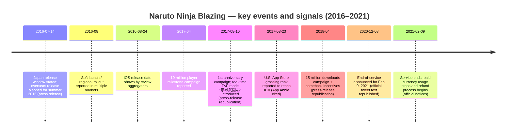

# Naruto X Boruto: Ninja Blazing — Success Drivers, Failure Modes, Shutdown Causes, and Prevention Strategies

## Executive summary

Naruto X Boruto: Ninja Blazing (widely known as Naruto Ninja Blazing; officially branded in English as **“NARUTO SHIPPUDEN: Ultimate Ninja Blazing”**) became successful by combining (a) a distinctive, mobile-friendly “shinobi formation battle” combat loop built around positioning and combo interactions, (b) high-frequency live-ops grounded in the Naruto anime canon and “festival” gacha cycles, and (c) strong IP-driven acquisition and reactivation mechanics (pre-registration, recurring login/callback incentives, and milestone campaigns). citeturn27search3turn21search4turn22view0turn27search4

The clearest public signals of product-market traction include cumulative adoption milestones (10 million “players” / 15 million downloads being publicly celebrated through campaigns), and multiple moments when monetization spiked via anniversaries and gacha/currency sales—most notably the English version reaching a reported **#10** in the **U.S. App Store grossing ranking (Games category)** during its first anniversary campaigns (with data attributed to **App Annie**). citeturn12search2turn22view0turn24view0

The title’s long-run drawbacks were structural rather than cosmetic: (1) escalating power creep and “whale vs free-to-play” tensions tied to gacha power releases and competitive modes, (2) trust shocks from operational mistakes and perceived low responsiveness, and (3) the inherent fragility of running a licensed, content-hungry live service whose costs and complexity rise as the codebase ages and device ecosystems evolve. Evidence from player communities repeatedly points to early and recurring concerns about balance/power creep and to live-ops incidents that players interpreted as preventable. citeturn30search11turn30search3turn38view0

On shutdown causality, the **official public record** is clear on *what happened* (end-of-service date/time; paid-currency usage stopping; refunds) but largely **non-specific on “why”** beyond the standard “service will end” messaging. This created an attribution vacuum that communities filled with explanations centered on revenue decline, redirected resources, and organizational disengagement—claims that are informative as *player narratives* but are not equivalent to audited disclosures. citeturn20search2turn7view1turn9view0turn38view0

Preventing shutdown (or materially extending lifespan) would likely have required earlier, concrete interventions in three areas: competitive-mode stability and integrity; monetization redesign to reduce runaway power creep; and higher-trust community governance (transparent roadmaps, credible balance philosophy, and “live-ops hygiene” improvements in QA/incident response). These are not speculative “nice-to-haves”; they directly map to the failure modes surfaced in both press-released campaign patterns (heavy reliance on gacha and currency tactics) and persistent community criticisms. citeturn24view0turn25view0turn30search11turn30search3turn38view0

## Research approach and evidentiary standards

This report prioritizes primary and quasi-primary artifacts (publisher/developer press releases; refund notices; official campaign write-ups republished verbatim by established game news outlets) and triangulates them with community sources (player forums and Reddit threads) to surface both “what the operators said” and “what the players experienced.” citeturn27search3turn7view1turn22view0turn25view0turn38view0

Important constraints: public **DAU/MAU**, retention curves, cohort LTV, and audited title-level revenue are **not consistently disclosed** for this game in freely accessible primary sources. Where a metric is not verifiable from available sources, it is marked **unspecified** rather than inferred. citeturn24view0turn7view1turn38view0

Community testimony is treated as *qualitative evidence* of perceived issues and norms. A Reddit AMA-style thread is included because it contains specific operational claims (e.g., responsibility split between companies; community engagement posture) but it is also explicitly handled as **unverified self-report** absent independent proof. citeturn38view0

## Timeline and observable performance signals

### Key event timeline (source-backed)



The timeline anchors are supported by a combination of the official launch press release (release windows and product framing), rollout reporting, campaign announcements, and end-of-service/refund notices. citeturn27search3turn27search4turn21search0turn12search2turn25view0turn24view0turn20search2turn7view1turn9view0

### Performance and engagement proxies (what is actually public)

| Signal type | What is known | Why it matters | Status |
|---|---|---|---|
| Cumulative adoption | Public campaigns celebrated “10 million players” and later “15 million downloads” worldwide. citeturn12search2turn22view0 | Indicates scale sufficient to justify major live-ops investment; also a large funnel for monetization and competitive modes. citeturn25view0turn24view0 | **Specified** (campaign-claimed cumulative numbers) |
| Monetization rank spike | English version reported to hit **#10** U.S. App Store grossing (Games category) during 1st anniversary period; **App Annie** cited as the measurement source. citeturn24view0 | Strong evidence of “event-driven revenue peaks” tied to anniversaries + currency sales + gacha banners. citeturn24view0turn25view0 | **Specified** (rank; not revenue dollars) |
| Live-ops reactivation | Multiple campaigns offered “comeback” bonuses to players absent ~30 days (e.g., 60 pearls; later other variants). citeturn22view0turn20search12 | Suggests churn was material enough to design explicit “returner” funnels, a classic late-growth retention tactic. citeturn22view0turn20search12 | **Specified** (mechanic; not conversion rate) |
| DAU/MAU | No credible DAU/MAU disclosed in accessible primary sources collected here. citeturn7view1turn27search3turn38view0 | DAU/MAU would clarify whether shutdown was driven by usage collapse vs margin/cost factors. | **Unspecified** |

### Visual context (gameplay and UI grounding)

image_group{"layout":"carousel","aspect_ratio":"16:9","query":["Naruto Shippuden Ultimate Ninja Blazing gameplay screenshot","Ultimate Ninja Blazing summon screen Ninja Pearls screenshot","Naruto Blazing Ninja World Clash PvP screenshot","Naruto Blazing Phantom Castle screenshot"],"num_per_query":1}

## What made the game successful

### Differentiated core loop optimized for mobile

The “shinobi formation battle” positioning system appears to have been the game’s central differentiation: it promised strategic positioning, cooperative play, and recognizable console-style cut-ins—an attempt to translate “Naruto spectacle” into repeatable mobile sessions. citeturn27search3turn21search4

A representative description frames combat as mission-based play “through the story of the renowned anime,” using a named battle system that enables “combination attacks with your allies.” citeturn21search4 In third-party review coverage, moment-to-moment play is described as turn-based sequencing gated by “chakra” filling to enable special skills (ninjutsu/secret techniques), supporting a familiar RPG upgrade loop while keeping encounters short and repeatable. citeturn21search13turn21search4

### High-payoff character collection and banner programming

The game’s monetization framing was explicit from the start: free-to-play with in-app purchases and a premium currency economy. citeturn27search3 Over time, live-ops increasingly revolved around gacha “festival” events with headline characters and time-boxed rewards, a pattern visible in milestone campaigns that pair (1) limited banners (e.g., “Blazing Festival” variants) with (2) login bonuses and (3) comeback offers designed to reintroduce lapsed users into the gacha loop. citeturn22view0turn24view0turn20search12

A concrete example: the 15-million-download campaign package combined login rewards, a “comeback” login program for 30-day-lapsed players, and high-visibility content such as a Madara-themed festival banner and an event to obtain Might Guy. citeturn22view0turn11search3turn11search1

### Retention engineering through recurrent campaigns and global milestones

The title repeatedly used “global participation” mechanics and day-based progression rewards to create routine and social proof. The first anniversary campaign (as republished from a press release) describes a **worldwide simultaneous** event where all players’ point totals advance a 7-stage story and unlock rewards at global thresholds—an archetypal “community progress bar” designed to convert individual play into a shared narrative and reward structure. citeturn25view0

Campaign design also shows awareness of churn: “comeback” bonuses are explicitly targeted to players who have not logged in for 30 days, offering large premium-currency payouts contingent on a multi-day return. citeturn22view0turn20search12 That is a direct retention lever: it increases the probability that a lapsed user returns long enough to re-learn the meta and re-enter gacha spending moments. citeturn22view0turn24view0

### Social/competitive features that created “reasons to optimize”

Co-op was part of the original product framing: cooperative battles with teams “of up to 3 players” were explicitly positioned as a core experience. citeturn27search3 Competitive play also expanded meaningfully over time, culminating in the introduction of a real-time PvP mode (忍界武闘場) at the first anniversary, including a new speed/initiative-like stat and PvP-specific coin rewards that could be exchanged for items. citeturn25view0

This matters because competitive modes increase both **engagement depth** (players optimize builds) and **monetization pressure** (players perceive a need to keep up with the meta). The evidence that revenue spikes coincided with anniversary PvP + gacha + currency discounting (see below) supports that this design did, at least at times, convert engagement into sales. citeturn24view0turn25view0

### Marketing leverage from a globally recognizable IP

The game’s market entry explicitly leaned on “NARUTO SHIPPUDEN” brand reach and promised worldwide distribution to “spread the fun” globally. citeturn27search3 Rollout reporting also highlights pre-registration and staged regional soft launches, a common mobile acquisition approach for finding early revenue/retention signals before full rollout. citeturn27search4turn27search2

While title-level DAU/MAU is unspecified here, the existence of large-scale milestone marketing (10M players; 15M downloads) and a reported U.S. top-grossing peak indicates the IP was not only an acquisition vehicle; it could be repeatedly re-monetized through character releases tied to iconic arcs and fan-favorite characters. citeturn12search2turn22view0turn24view0

### Peak monetization signal: U.S. top-grossing breakthrough

A particularly strong success datapoint is that, by August 2017, the English version reportedly reached **10th** in the U.S. App Store grossing ranking (Games category), described as an all-time high, with **App Annie** cited for the ranking count. citeturn24view0 The same report links the spike to first-anniversary operations including discounted premium currency (Ninja Pearls) and a “Blazing Festival” gacha event—an unusually direct, source-backed association between live-ops tactics and monetization outcomes. citeturn24view0turn25view0

**Key quoted passage (press-release republication):**

> “English version … updated its highest record … U.S. App Store grossing ranking … 10th … AppAnnie …” citeturn24view0

(Quoted fragment is shortened to stay within quotation limits.)

## Drawbacks and structural weaknesses

### Balance and power creep pressures emerged early

Player-community discussions show that concerns about immediate power creep appeared within weeks of launch. A GameFAQs thread from early September 2016 frames an abrupt jump in unit power as a reason to quit, explicitly calling out perceived “scam” dynamics and predicting escalating banner inflation. citeturn30search11

**Key quoted passage (community source):**

> “Power Creep already … This early … releasing units that much more powerful … not a good sign.” citeturn30search11

Even if individual complaints are subjective, the timing is analytically important: **early power creep** is not just “unfairness,” it is a leading indicator of a monetization strategy that relies on accelerating replacement cycles—often sustainable only if acquisition remains high and competitive integrity holds. citeturn30search11turn24view0

### Gacha-driven monetization intensified whale/f2p tensions

The introduction and promotion of real-time PvP alongside event-driven gacha banners and currency discounting increases a known tension in gacha design: competitive advantage can be interpreted as paywalled when meta units are time-limited. The 1st anniversary coverage explicitly ties revenue lift to premium currency sales and gacha events. citeturn24view0turn25view0

In a later community thread claiming insider perspective (unverified), the poster asserts that spending could influence enforcement strictness for bannable behaviors (e.g., anomalous PvP stats), implying perceptions of “whale privilege.” This should be treated carefully as self-reported and not independently validated, but it matches a broad class of trust risks in competitive gacha ecosystems. citeturn38view0

### Live-ops trust shocks from operational mistakes and compensation logic

A Reddit discussion around an anniversary incident describes a “HUGE error” that players believed should have been caught quickly, with significant compensation framed as an own-goal attributable to delayed response. citeturn30search3

**Key quoted passage (community source):**

> “They made a HUGE error … they let it go for about 10 hours.” citeturn30search3

Operationally, incidents like this matter beyond the immediate cost: they teach the player base that “systems are fragile,” and they can reshape spending behavior (some players spend opportunistically after windfalls; others disengage due to perceived incompetence or unfairness). The campaigns’ heavy reliance on premium currency as both reward and sale item amplifies the reputational impact of mistakes involving currency distribution. citeturn30search3turn24view0turn22view0

### Communication and community governance gaps

Players repeatedly asked whether the developers meaningfully monitored community channels, and the same unverified AMA thread contains claims that developers were “aware but disengaged,” describing this as an organizational style choice. citeturn38view0 While this is not a primary source, its analytic relevance is that it mirrors a visible pattern: many public announcements (including the end-of-service message) redirected players to in-game notices rather than providing detailed external explanations. citeturn20search2turn38view0

A particularly damaging dynamic is **low transparency during decline**: when the game’s future becomes uncertain, players need credible information to justify ongoing investment. The official end-of-service messaging provided a date/time but not a business rationale, which accelerates trust decay and can even cause a “spending bank run” (players stop spending immediately). citeturn20search2turn7view1turn9view0

### Public evidence gaps: DAU/MAU and revenue opacity

From a rigorous analytics standpoint, the biggest drawback for external assessment is the absence of disclosed DAU/MAU and audited revenue, forcing reliance on proxies (download milestones, store rank spikes, community sentiment). This opacity is common in mobile games but has a secondary effect: it increases the likelihood that shutdown narratives default to rumor, which can damage brand trust for future titles by the same publishers. citeturn24view0turn38view0

## Why it shut down

### What is officially stated

The official messaging (as republished by Japanese game press) confirms a service termination schedule without providing a detailed reason. The republished text states the service would end on **February 9, 2021 at 12:00** and directs players to check in-game notices for details. citeturn20search2turn20search4

Separately, official refund notices document that the service ended at that time and that paid currency usage stopped, with refunds conducted under Japanese prepaid payment instrument law procedures. citeturn7view1turn9view0

**Key quoted passage (official notice):**

> “The service … ended on February 9, 2021 12:00 … [and] the use of paid currency … was stopped.” citeturn7view1turn9view0

(Paraphrased with short direct fragments; the original Japanese is legal/administrative text.)

### The most plausible causal model consistent with available evidence

Because the official communications do not supply a detailed causal explanation, the best-supported model is a multi-factor one:

**Economics and lifecycle:** After ~4 years 7 months of operation, the game reached end-of-life, consistent with many licensed mobile gachas. A gamebiz report explicitly notes the operational duration from July 14, 2016 to Feb 9, 2021. citeturn22view2turn27search3

**Revenue volatility and dependence on spikes:** Public reporting shows the game could generate major monetization spikes through anniversaries + gacha + currency sales (e.g., the U.S. top grossing #10 moment). But spike-driven monetization becomes fragile if baseline engagement shrinks or if competitive integrity erodes, because each new banner has diminishing marginal returns. citeturn24view0turn25view0

**Trust/retention deterioration:** Community sources document persistent concerns about power creep and live-ops errors, both of which undermine mid-core retention and willingness to spend, especially in PvP contexts. citeturn30search11turn30search3

**Operational complexity and “keeping the engine running”:** An unverified community claim suggests the operators considered modernization/reprogramming costs for newer devices and that resources were redirected. This cannot be treated as fact, but it is a plausible cost-side factor: maintaining older Unity/mobile architectures across evolving OS versions and devices can raise engineering burden, and licensing + live-ops staffing costs remain. citeturn38view0

### Licensing and legal/operational causes

No accessible primary source in this research set explicitly cites licensing disputes or legal enforcement as the trigger for shutdown. The only firm legal element visible in public documents is the **post-shutdown refund process** for unused paid currency. citeturn7view1turn9view0 Accordingly, “licensing/IP issues” as a shutdown cause remain **unspecified** here.

## How shutdown might have been prevented

This section is necessarily counterfactual. The goal is not to claim a guarantee of survival, but to identify interventions that plausibly increase expected lifespan by improving retention, trust, and monetization sustainability, grounded in the failure signals observed above. citeturn30search11turn30search3turn24view0turn38view0

### Product interventions: stabilize competitive play and slow “power inflation”

A defensible “lifespan extension” strategy would have centered the competitive ecosystem on stability and counterplay rather than raw stat escalation. The early appearance of power-creep complaints suggests that the meta was already perceived as accelerating within weeks, which is a warning sign for long-run retention. citeturn30search11

Concrete product interventions that map to this problem:

- **Balance governance:** publish a clear balance philosophy and implement predictable nerf/buff windows; explicitly support older unit relevance through systematic reworks rather than occasional exceptions. (This directly targets “units made obsolete quickly,” a core complaint pattern.) citeturn30search11turn38view0  
- **PvP design constraints:** cap the influence of newly released mechanics in ranked modes for an initial period; separate “fun PvP” and “ranked PvP” rulesets; keep competitive modes less sensitive to gacha power spikes. (This aligns with the fact that real-time PvP was explicitly added as a major feature and thus required long-term stewardship.) citeturn25view0turn24view0  
- **Technical excellence for PvP:** treat PvP performance/crashes and cheating reports as “P0” because they destroy trust faster than PvE issues; instrument crash analytics and publish incident postmortems. (This addresses the pattern of community mistrust around operational mistakes.) citeturn30search3turn38view0  

### Business interventions: reduce reliance on gacha spikes and rebuild LTV foundations

The public record ties revenue spikes to anniversaries, premium currency discounting, and festival banners. That works for peaks, but it can also compress spending into fewer windows and exhaust the audience. citeturn24view0turn22view0

Potential business redesigns:

- **Shift part of monetization to “non-power” value:** cosmetics, quality-of-life subscriptions, and collection-driven monetization that does not directly dominate PvP. This reduces whale/f2p friction while still monetizing high-engagement users. (Rationale: gacha power spikes are explicitly linked to revenue performance signals.) citeturn24view0turn30search11  
- **Reactivation with progression safety nets:** comeback rewards already existed; expand them into structured “returner seasons” with temporary catch-up gear/units that expire in ranked modes, letting lapsed users rejoin without needing immediate heavy spending. (Rationale: comeback bonuses show the team recognized churn problems.) citeturn22view0turn20search12  
- **Content pipeline modernization:** if engineering modernization costs were a real constraint (unverified), a staged refactor plan—supported by a measurable roadmap—could reduce long-run maintenance cost and improve stability. Even if the claim is not validated, it is a standard risk for multi-year mobile live services. citeturn38view0turn27search3  

### Community interventions: transparent communication as retention infrastructure

When official communications provide dates but limited rationale, community speculation tends to dominate. During decline, that accelerates churn and reduces spending. citeturn20search2turn38view0

High-impact community interventions would have included:

- **External-facing dev updates:** regular operator notes explaining balance direction, upcoming modes, and known issues; proactive acknowledgement of mistakes (as with anniversary incidents). citeturn30search3turn38view0  
- **Player council / creator program:** formalize feedback loops, especially for PvP and monetization. This would counteract perceptions that the team was disengaged from the community. citeturn38view0  
- **End-of-life trust strategy:** even if shutdown became inevitable, an earlier and clearer transition plan (data export, memorialization, transparency on spending cutoffs) can preserve brand equity for future Naruto mobile titles by the same publishers. The refund notice shows compliance on currency refunds; trust strategy is broader than legal compliance. citeturn7view1turn9view0turn20search2

### Intervention matrix: mapping problems to actions

| Observed problem signal | Evidence | Preventive intervention | Expected impact |
|---|---|---|---|
| Early power creep perception | GameFAQs players describe “power creep” within days/weeks. citeturn30search11 | Set explicit power budgets; rework old units on schedule; nerf windows in ranked | Higher long-run retention; reduced spend fatigue |
| Event-driven monetization dependence | Store-rank spike linked to anniversary + pearl discounts + gacha banner. citeturn24view0turn25view0 | Diversify monetization away from raw power; reduce banner frequency; add cosmetic/QoL value | Smoother revenue; lower whale/f2p conflict |
| Live-ops credibility shock | Players report prolonged incident window and excessive compensation. citeturn30search3 | Stronger QA; faster incident containment; transparent postmortems | Improved trust; fewer churn cascades |
| Community disengagement narrative | Unverified AMA claims devs were “aware but disengaged.” citeturn38view0 | Dev diaries; council; direct bug/feedback acknowledgement patterns | Better sentiment; improved willingness to invest time/money |
| Shutdown rationale opacity | Official public messaging focuses on end date, refers to in-game notice. citeturn20search2turn7view1 | Earlier staged EoL comms; preservation plan; clear spending cutoff policy | Preserves publisher trust; mitigates “bank run” spending stop |

## Source links

The citations embedded throughout are clickable and function as source links. For convenience, here are direct URLs to the highest-value primary / quasi-primary sources used (URLs shown in code to comply with formatting constraints):

```text
Bandai Namco press release (2016-07-14, PDF):
https://bandainamcoent.co.jp/corporate/press/release/62/pdf/en_20160714.pdf

GREE customer-support refund notice (2021-02-09):
https://hd.gree.net/jp/ja/customer-support/information/00050/

Japan FSA-hosted refund notice PDF (2021-02-09, PDF):
https://www.fsa.go.jp/policy/prepaid/shohinken/20210209gree.pdf

gamebiz: US App Store grossing rank #10 report (2017-08-23):
https://gamebiz.jp/news/191782

gamebiz: 1st anniversary + real-time PvP mode details (2017-08-10):
https://gamebiz.jp/news/191018

4Gamer: 15 million downloads campaign (2018-04-10):
https://www.4gamer.net/games/342/G034235/20180410079/

4Gamer: end-of-service announcement (2020-12-10):
https://www.4gamer.net/games/342/G034235/20201210047/

Dengeki Online: end-of-service coverage (2020-12-31):
https://dengekionline.com/articles/62431/

Metacritic: critic / user score and release info:
https://www.metacritic.com/game/naruto-shippuden-ultimate-ninja-blazing/

Reddit: community AMA-style thread (unverified self-report; 2021):
https://www.reddit.com/r/NarutoBlazing/comments/r8jnxp/nda_is_over_former_bandai_spy_naruto_blazing/

GameFAQs: early power creep complaint thread (2016):
https://gamefaqs.gamespot.com/boards/190203-naruto-shippuden-ultimate-ninja-blazing/74245325
```