# MUMOSA Team Map

```mermaid
flowchart TB
    A["MUMOSA Team Alignment"]

    A --> B["Client Now"]
    A --> C["Client Future"]
    A --> D["Digital Prototype Focus"]
    A --> E["Avoid"]

    B --> B1["Forensic / post-crisis focus"]
    B --> B2["Investigation + training"]
    B --> B3["Text + images + schema + simulation"]
    B --> B4["Source-grounded Q/A"]

    C --> C1["Real-time support"]
    C --> C2["Timeline / time slider"]
    C --> C3["Danger highlighting"]
    C --> C4["Scenario planning"]
    C --> C5["Agent-like guidance"]

    D --> D1["Primary user:<br/>post-crisis investigator"]
    D --> D2["Primary task:<br/>understand what happened<br/>and verify evidence"]
    D --> D3["Dashboard:<br/>search, sources, chronology,<br/>event overview"]
    D --> D4["VR:<br/>spatial review, hazards,<br/>scene context, training support"]
    D --> D5["Key screens:<br/>entry, overview, evidence,<br/>timeline, VR handoff"]

    E --> E1["No hard profession gate"]
    E --> E2["No separate full journeys<br/>for every role"]
    E --> E3["No full real-time system build"]
    E --> E4["VR should not replace<br/>the dashboard"]
```

## Plain Summary

### 1. What MUMOSA is right now

- A multimodal dashboard.
- Mainly for forensic and post-crisis investigation.
- Also supports responder training.
- Works across text, images, schema, and simulation.

### 2. What MUMOSA wants to become

- A more real-time crisis support system.
- Includes timeline control, danger highlighting, and agent-like guidance.

### 3. What our prototype should focus on

- One main user: post-crisis investigator.
- One main task: understand what happened and verify evidence.
- Dashboard for search, source comparison, chronology, and overview.
- VR for spatial review and hazard understanding.

### 4. What to avoid

- Do not force users to pick CSI / firefighter / etc. before entry.
- Do not build separate full journeys for every role.
- Do not try to solve the whole real-time future system this semester.
- Do not make VR the entire product.
