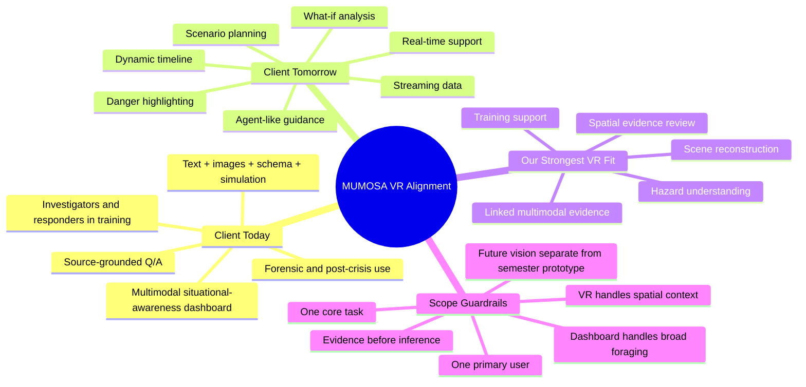

# MUMOSA VR Vision Alignment

Purpose: align our team's VR direction with the client's published MUMOSA goals, keep the assignment scoped, and refine the vision into something stronger and more client-relevant.

Sources:
- `mumosa-client-paper.pdf`
- `brief-and-assignment-scope.md`
- class discussion and current paper prototype direction

## Quick Read

The client's current MUMOSA work is best understood as a multimodal situational-awareness dashboard for forensic/post-crisis investigation and first-responder training, with a future ambition toward real-time crisis response. Our VR direction fits best when it is framed as a spatial evidence-review mode that complements the dashboard, not replaces it.

## Team Mindmap

## What The Client Currently Is

Based on the paper, MUMOSA is currently:

- an interactive dashboard for multimodal situational awareness across text, images, schemas, and simulation `(pp. 1-2)`
- a system for understanding and analyzing complex crisis scenarios across modalities `(p. 1)`
- a current forensic/post-crisis resource for investigators and first responders at situational awareness levels 1 and 2 `(pp. 4, 7-8)`
- a tool for assembling crisis documentation and "lessons learned" investigative reports `(p. 2)`
- a tool for creating training resources for responders who may face similar crises in the future `(p. 2)`
- a natural-language Q/A system grounded in source evidence, not just a static visualization `(pp. 2, 4-5)`
- a platform where users can browse supporting evidence, inspect schema relationships, and explore 3D simulations `(pp. 2, 4-7)`

## What The Client Appears To Want Right Now

The current paper suggests the client wants a system that can:

- reduce fragmented information by bringing multiple evidence types into one interface
- support evidence-based understanding of what happened, when it happened, and how events connect
- let users compare evidence across modalities instead of relying on only one source
- help users build their own narrative of a complex event `(p. 2)`
- support chronological reconstruction for investigators `(p. 8)`
- support training exercises for responders dealing with hazards in physical space `(pp. 7-8)`
- allow editing and annotation of schemas and simulations `(pp. 2, 6)`
- surface danger and spatial relationships inside simulation views `(p. 7)`
- keep the evidence grounded enough that users can trace back to trusted sources `(pp. 4-5, 8)`

## What The Client Wants In The Future

The paper also makes it clear that MUMOSA is meant to grow beyond its current forensic scope. The future direction includes:

- real-time crisis response support `(pp. 1, 7-9)`
- real-time situational awareness and decision-making `(p. 1)`
- dynamic timeframes rather than only one fixed incident snapshot `(p. 7)`
- a timeline and adjustable slider connecting photos, summaries, schema changes, and 3D reconstructions `(p. 7)`
- streaming multimodal data and scalable back-end processing `(p. 7)`
- filtering incoming data for quality and misinformation `(p. 7)`
- scenario planning and "what-if" analysis `(p. 8)`
- automatic highlighting of immediate danger and key crisis regions `(pp. 7-8)`
- a more agent-like interaction that can push alerts, ask clarifying questions, and suggest follow-ups `(p. 8)`

## Your Vision, Distilled

Your idea is not random. It is a coherent extension of the client's direction.

At its core, your vision is:

- a spatially reconstructed crisis scene in VR
- fed by multimodal evidence sources such as cameras, drones, 360 capture, street views, and potentially LiDAR or other reconstruction inputs
- where AI gently marks likely hazards, objects, or evidence clusters in the environment
- and the user can inspect them in place
- with the system revealing context, relationships, and suggested next evidence paths

The strongest part of your vision is that it treats VR as a way to understand crisis evidence in spatial context rather than as a gimmick.

## What In Your Vision Already Matches The Client Well

Your concept already aligns with several client goals:

- It supports situational awareness through spatial understanding.
- It uses simulation as an evidence surface, which the paper already values.
- It fits the client's interest in danger highlighting and annotated 3D views.
- It connects modalities rather than isolating them.
- It supports both investigation and training value.
- It points naturally toward the future real-time direction discussed in the paper.

## What Needs To Be Improved So It Fits The Client Better

The vision gets stronger if we refine the framing.

### 1. Make Evidence Grounding Explicit

Right now the most important improvement is to keep every AI insight tied to sources.

Instead of:
- "AI says this car crash caused the fire."

Prefer:
- "Possible relation detected."
- "Supported by drone feed 2, camera 4, and report excerpt."
- "Confidence: medium."
- "Open linked evidence."

This fits the client's evidence-based, source-grounded direction much better.

### 2. Separate Current Scope From Future Vision

The client paper clearly distinguishes:

- current forensic/post-crisis and training use
- future real-time response use

So our team should not present the full live sensor-fusion VR world as if that is the semester deliverable. It is better to present it as:

- a future-facing client vision
- with a smaller prototype that proves the interaction logic

### 3. Keep The Dashboard And VR In Different Roles

The dashboard and VR should not do the exact same job.

The dashboard should own:

- broad search
- source comparison
- chronology
- document foraging
- schema inspection
- trusted-source review

VR should own:

- spatial context
- hazard understanding
- scene reconstruction
- evidence in place
- route/accessibility understanding
- object-of-interest inspection
- training-oriented spatial review

### 4. Reduce Overclaim Around "Real-Time"

Some parts of your concept are plausible now, while others are better treated as research vision.

Reasonable for the assignment or a near-term prototype:

- preprocessed reconstructed scene
- subtle AI outlines for likely hazards or objects of interest
- gaze/select interaction
- contextual evidence cards
- links to related sources
- optional relationships between selected objects and other evidence

Better framed as future R&D:

- continuously fused live multi-sensor scene reconstruction
- robust real-time cross-modal inference during an unfolding incident
- strong enough automated AI reasoning for safety-critical decisions
- low-latency trustworthy updates from many incoming feeds at once

### 5. Pick A Clear Primary User

This is where the team can reduce "broadness."

The strongest current fit is:

- investigators
- CSIs
- fire investigators
- post-crisis analysts

The strongest secondary fit is:

- responder training

The weaker primary fit for this specific assignment is:

- frontline EMT/firefighter live-response field use as the main story

That does not mean responders are irrelevant. It means the current prototype becomes sharper if the main story is post-crisis spatial review first.

## Recommended Refined Concept

### Working Title

**MUMOSA Spatial Evidence Review Mode**

### One-Sentence Version

A VR mode that lets investigators and trained responders inspect a reconstructed crisis scene, see AI-highlighted hazards or evidence clusters in place, and open source-grounded multimodal context without losing the spatial understanding of the event.

### Why This Is Stronger

This version:

- stays close to the client's current forensic goals
- preserves training value
- still supports the future real-time direction
- avoids pitching VR as a replacement for the dashboard
- makes the role of AI more trustworthy and believable

## Recommended Experience Flow

### Current Assignment Version

1. The user starts in the dashboard with a selected incident and timeframe.
2. The dashboard helps the user identify a scene, event cluster, or question worth spatial review.
3. The user enters a VR reconstruction of the scene.
4. The system highlights likely hazards, objects, or evidence clusters using subtle visual cues.
5. The user selects one object or zone.
6. A context card appears with:
   - a short AI summary
   - confidence level
   - timestamp
   - source types
   - linked evidence
   - suggested next inspection step
7. The user can inspect a second linked object or return to the dashboard for broader evidence review.

### Future Client Vision Version

1. The scene updates over time through connected camera, drone, or other incoming feeds.
2. A timeline slider lets the user scrub through changes in the incident.
3. AI highlights newly emerging risk regions or discrepancies.
4. The system pushes alerts or follow-up suggestions.
5. The user opens linked evidence or asks questions directly about the selected object or zone.

## Recommended Information Design Inside VR

To fit the client's goals, VR content should be structured like this:

- subtle outlines for likely objects or risk zones
- on-demand overlays, not cluttered always-on labels
- evidence cards that show:
  - what the system thinks it is
  - why it thinks that
  - where the supporting evidence came from
  - what related evidence is nearby or linked
- clear distinction between:
  - observed fact
  - model inference
  - hypothesis or possible connection

This is critical. The client's system is about helping users understand complex evidence, not hiding it behind confident-looking AI magic.

## What VR Should And Should Not Be

### VR Should Be

- a spatial review layer
- a place to inspect hazards and objects in context
- a way to connect evidence to physical space
- a secondary investigation mode
- a training-support mode

### VR Should Not Be

- the only place where investigation happens
- the main way users forage through fragmented documents
- a replacement for timeline, schema, or document review
- presented as a fully solved real-time field system for this assignment

## Recommended Position On "CSIs Or Training Or Both?"

At the overall system level, both make sense.

At the VR level, we should not split the primary story evenly.

### Best Recommendation

- Primary VR story: post-crisis investigator / CSI / fire-investigator spatial review
- Secondary VR value: responder training and hazard interpretation
- Future extension: incident-command or live-response support

Why this is the best fit:

- It matches the client's current forensic focus.
- It still respects the paper's training direction.
- It leaves room for the real-time future without overclaiming.
- It matches our current prototype strengths more naturally than a pure live-response pitch.

## What We Can Realistically Propose This Semester

If we want the concept to feel ambitious but believable, the team should propose:

- one incident
- one reconstructed scene
- one primary user role
- one core task
- one clear path from object selection to source-grounded evidence

### Example Scope

Primary user:
- investigator / CSI / fire investigator

Task:
- review a crisis scene to understand hazards, relationships, and evidence in context

Prototype proof points:

- AI-highlighted object or hazard zones
- evidence popup tied to sources
- one linked relationship between two objects or events
- one optional timeline or before/after state
- clear separation between dashboard triage and VR scene review

## Suggested Language For The Client

Here is a client-facing version of the concept that is more aligned than the raw version:

> We propose VR not as a replacement for the MUMOSA dashboard, but as a spatial evidence-review mode within it. In the current forensic and training context, this mode would let users inspect a reconstructed incident scene, see AI-highlighted hazards or objects of interest, and open source-grounded multimodal evidence directly in place. Over time, this interaction model could extend into MUMOSA's future real-time direction through timeline-aware updates, danger-region highlighting, and agent-guided follow-up suggestions.

## Final Recommendation

Your original instinct is good. The concept becomes much stronger when framed this way:

- not "VR for everything"
- not "VR instead of the dashboard"
- not "live field response solved"

Instead:

- VR as a spatial evidence-review mode
- grounded in source-backed multimodal information
- currently best suited to post-crisis investigation and training
- designed so it can grow toward the client's future real-time ambitions

That is the version most likely to feel ambitious, intelligent, and aligned rather than broad.
