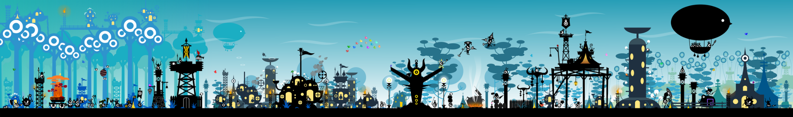
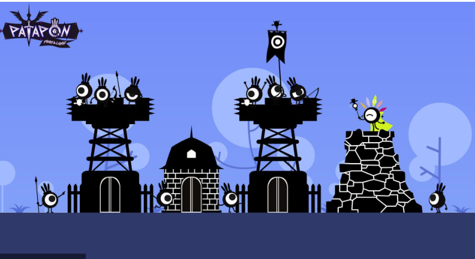
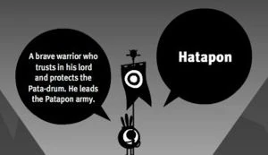
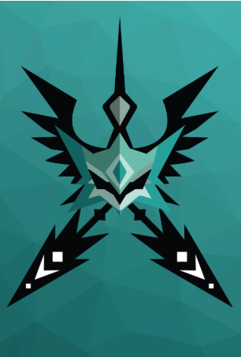
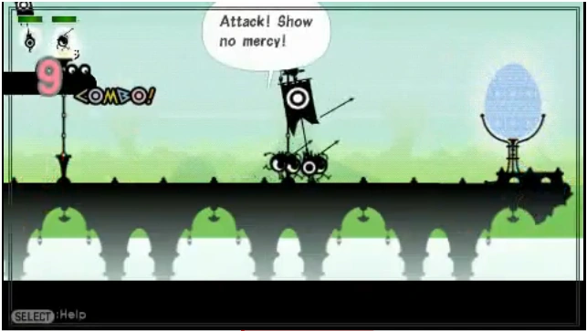
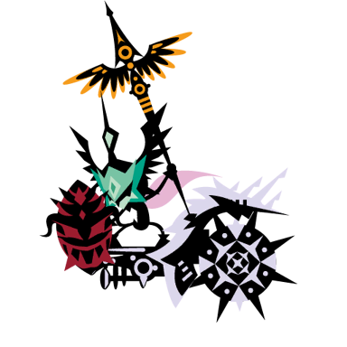
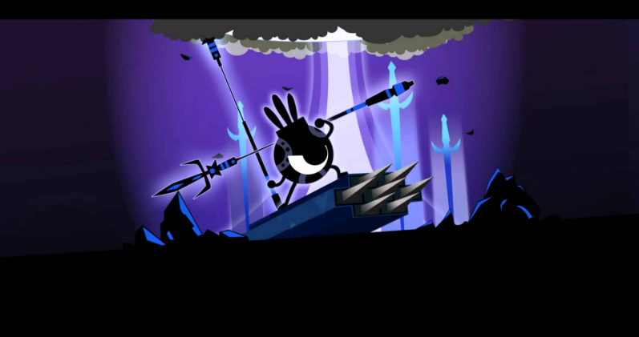
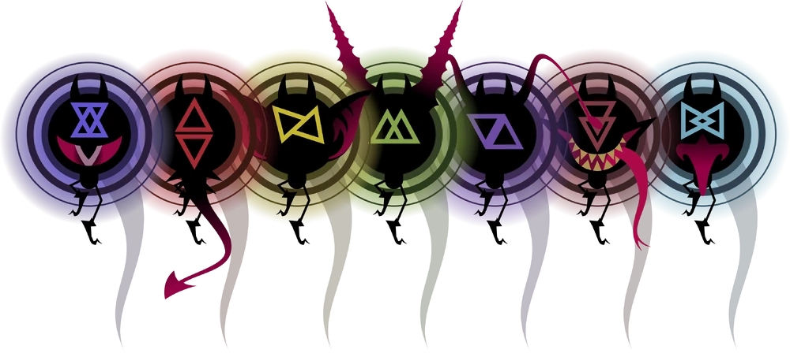
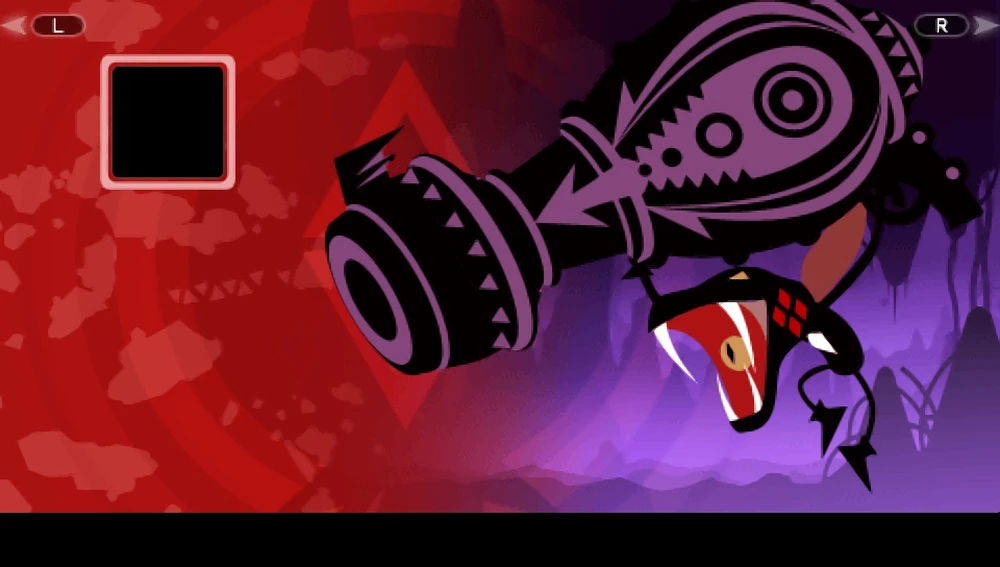
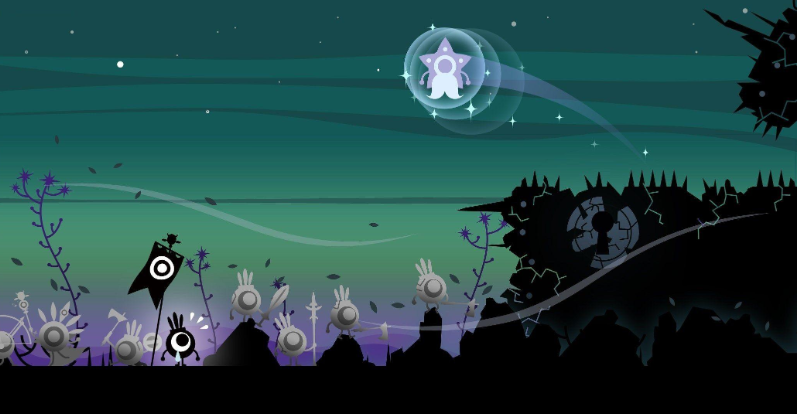

This document outlines the core mechanics, narrative systems, and technical requirements for Patapon VR: The First Beat. It serves as the central reference for development.

# PROJECT: PATAPON VR - THE FIRST BEAT

DOCUMENT TYPE: Master Design Document

VERSION: 1.0 (Gold)

DATE: December 2025

By Georgi Tsvetanski

Version: 1.0 (Final Concept)

Genre: VR Rhythm-Action / Roguelite Strategy

Target Platform: Meta Quest 3 (Standalone) & PCVR

Engine: Unity (OpenXR)

Visual Style: Low Poly Stylized

# Table of Contents

1. Executive Summary

1.1 High Concept

1.2 The Hook

2. Narrative & Lore

2.1 The Setting: The Golden Age

2.2 The Protagonist: The Avatar

2.3 The Antagonists: The Ah-Ooh Empire

2.4 The Arrival (Tutorial) 2.5 The Uberhero & The Pact

2.6 The Elder Tribe & The World Egg

2.7 Cosmology

2.8 Origin of the Uberhero

2.9 Sub-Plot: Zigoton Exodus

3. The Player Rig

3.1 The Chariot Structure

3.2 Propulsion (The Twin Titans)

3.3 Movement Physics

4. Gameplay Mechanics

4.1 The Drums (Input)

4.2 Commands

4.3 Fever Mode & Hero Avatar

4.4 Co-op: The Tactician

5. Customization

5.1 Weapons

5.2 Runes

5.3 Miracle Totems

6. Enemy Faction: The Archfiends

6.1 Boss Mechanic: The Sealing

6.2 Antagonist: King Ighl

7. Roguelite Structure

7.1 The Hub (Smithy, Evolution, Tree of Life)

7.2 The Expedition (Map & Biomes)

7.3 NPC Encounters (Hoshipons)

7.4 Star-Boons

8. Art & Technical Direction

8.1 Visual Style

8.2 Optimization

8.3 Character Design

9. Development Roadmap

9.1 Phases 1-4

10. Epilogue: The Closing of the Box

## Version History

v0.1 - Concept Draftv0.5 - Mechanics Definitionv0.9 - Narrative Integrationv1.0 - Final Concept Lock

## 1. Executive Summary & High Concept

The First Beat is a first-person VR prequel to the Patapon series. Set in the mythic "Golden Age," the player embodies the physical manifestation of the Almighty. Unlike the sequels where the Almighty is a distant spirit, here you are a physical presence on the battlefield, riding a Divine Chariot.

The Hook: You do not press buttons. You physically wield the "Bachi" (Drumsticks) to command an army of 3D Patapons. You must build the legendary Prime Patapolis and lead expeditions into the "Static" to save the world from being unmade, ultimately sacrificing your physical form to preserve the tribe (setting up Patapon 1).

## 2. Narrative & Lore Bandai Official History Hall

Patapon 1 Story Recapped and Explained

Patapon 2 Story Recapped and Explained

Patapon 3 Story Recapped and Explained

### 2.1 The Setting: The Golden Age

The world is young, vibrant, and volatile. The "Great Patapolis" is currently being built. The Zigotons are not enemies yet; they are nomadic allies. The atmosphere is one of hopeful expansion, contrasted by the encroaching threat of "The Static."

### 2.2 The Protagonist: The Avatar

You are the Avatar of the Rhythm. You are 3 meters tall, a silent deity composed of shadow and starlight. You hold the Primal Bachi—drumsticks made of pure energy.

### 2.3 The Antagonists: The Ah-Ooh Empire

- The Identity: The antagonists are the Ah-Ooh, the Almighty's "First Draft" of creation. They are a powerful, ancient civilization that predates the Patapons.

- The Corruption: They are not undead zombies; they are Corrupted Nobility. Driven by jealousy, they have made a pact with the Archfiends. They are alive, but the dark magic has twisted their forms.

- Visual Language (The Contrast):

- Patapons (The Beat): Small, Round, Obsidian Black. They represent focus.

- Ah-Ooh (The Voice): Tall, Lanky, Pale Jade Skin. They represent venom and envy.

- Key Design Feature: The Mask:

- While Patapons are defined by their Eyes, the Ah-Ooh are defined by their Mouths.

- They wear ornate Golden Masks that cover their eyes but accentuate their mouths (amplifying their magic chants).

- The Goal: They view the Patapons as "vermin." They seek to silence the drums so their own "Song of the Void" can rule reality.

6. The Philosophy: Unlike the Patapons, who believe in reincarnation through the Earth, the Ah-Ooh seek Physical Immortality. They worship the Serpent because it sheds its skin to be "born again" without dying.

7. The Visual Motif:

- Jade Skin: Their green skin is not just a color; it represents their attempt to become "Serpent-Kin."

- Armor: Their golden armor is scaled, mimicking the shedding skin of a viper.

- Banners: Their war flags depict a Coiled Snake eating the Sun (symbolizing their desire to swallow the Almighty's light/rhythm).

### Design Rationale:

- It justifies King Ighl: He isn't just a random snake-guy. He is the High Priest of the Serpent Cult. He succeeded in becoming a "Snake" (Miss Covet-Hiss) later, but at the cost of his soul.

- It explains the "Hissing": We established their audio is "Vocals/Noise." Now, their chanting can sound like sibilant whispering (Ssss-Ssss), contrasting sharply with the punchy Pata-Pata of your drums.

- It fits the "Sin" Theme: The Serpent is the universal symbol of Envy and Temptation.

### 2.4 The Arrival: The First Beat (Tutorial)

- The Context: The Patapons are losing the war. The "Great Patapolis" is a ruin. Grandmaster Kampon built the Divine Chariot to save his people, but it sits cold and dead because no mortal is strong enough to pilot it.

- The Scene:

- The Surface: It is raining. Hatapon (the sole survivor of his squad) is cornered by a pack of Ah-Ooh Scouts.

- The Cover: He backs up against the massive, stone wheel of the dormant Chariot, using it as cover. To him, it's just a monument.

- The Descent: After the "Ritual of the Pact" (2.5.1), your Spirit streaks down from the cosmos like a falling star.

- The Impact:

- You don't land on the ground; you slam directly into the Throne of the Chariot.

- The Awakening: The impact knocks the Ah-Ooh back. The stone eyes of the Twin Titans ignite with White Fire (The sign of the Divine). The drums materialize on the railing.

- The First Beat:

- Hatapon looks up, terrified but hopeful. He sees the "Statue" come to life.

- You strike the drums: PATA - PATA - PATA - PON.

- The Action: The Chariot lurches forward, crushing the Ah-Ooh vanguard. Hatapon scrambles into the sidecar. The Golden Age begins.

Design Rationale:

- High Stakes: It starts with immediate danger/combat rather than hitting a drum in a void.

- Lore Accurate: It respects that the Ah-Ooh are already corrupted and bullying the Patapons.

- Emotional Hook: You save Hatapon's life in the first 30 seconds. This explains why he is so loyal to you immediately.

### 2.5 The Protagonist: The Uberhero & The Pact

- The Origin: In the beginning, the Almighty created two constants: Hatapon (The Guide) and the First Mask (The Vessel).

- The Pact: The Almighty sought a spirit strong enough to wield the Rhythm but lacked a physical form to lead the charge. They found You (The Player) drifting in the cosmos.

- The Fusion: You signed the Pact. Your spirit fused with the First Mask, creating the Uberhero—a 3-meter tall warrior-construct.

- VR Context: When you look down at your body, you do not see human hands. You see the obsidian, star-flecked limbs of the Vessel. You are not just a God watching from the sky; you are a constructed demigod standing on the battlefield.

### 2.5.1 The Ritual of the Pact (The Opening Scene)

- The Void: The game loads into absolute silence and darkness. You are floating in a nebula.

- The Call: You hear a deep, resounding beat from everywhere and nowhere. DON... DON... (This is the Almighty speaking).

- The Offer: A spectral, translucent version of the Chariot’s drums floats in front of you. They are the only lit objects in the universe.

- The Response (Tutorial): To accept the Pact, you must mimic the beat.

- Mechanic: This is the velocity calibration test. You must hit the drums hard enough (>2.0 m/s) to match the Almighty's rhythm.

- The Fusion:

- Upon successfully repeating the beat, the First Mask slams onto your face (visual vignette constriction).

- The spectral drums solidify into matter (The Chariot).

- Gravity turns on. You plummet from the stars down to the planet surface, transitioning directly into Section 2.4 (The Creation Myth).

It establishes the "Call and Response" mechanic instantly—you can't even start the game until you prove you have Rhythm.

### 2.6 The Elder Tribe: The Ah-Ooh

- Origin: The Almighty's first creation. Gifted with Song but lacking Rhythm.

- The Conflict: Jealous of the Patapons, they sought to prove their superiority. The Fall: They sang the "Aria of the Void," tearing the hole in reality.

- Current State: They are The Corrupted. They have not yet rotted into the Bonedeths we see in the future. They are a twisted, living empire of jade-skinned zealots waging a war of silence against the drums.

### 2.6.1 The Fall: The Cracking of the World Egg

- The Ancient History: The world was once encased in the "Resonant Sphere" (The World Egg)—a barrier of pure rhythm that protected reality.

- The Betrayal: Jealous of the Almighty’s favor, the Ah-Ooh High Council ordered their greatest General (The Vessel) to sing the "Aria of the Void."

- The Cataclysm: The Aria acted as a sonic boom. It didn't just open a door; it Cracked the World Egg.

- The Consequence: The Void leaked in through the fissures, twisting the Ah-Ooh into evil and relentless cruelties.

- (This sets up Patapon 2, where the damaged Egg is eventually smashed open completely to release the Princess.)

### 2.7 Cosmology: The Song vs. The Silence

- The Almighty is not just a ruler; He is the Composer of reality. The world exists only because He maintains the Rhythm.

- The Archfiends are entities from the Outer Void (The space between stars). They are not "Evil Gods" with complex plans. They are cosmic parasites that feed on "Sound/Life."

- The Threat: If the Archfiends win, they don't rule the world. The world simply dissolves. The "Static" takes over, and the song ends.

### Summary of the Divine Hierarchy

- The Almighty: The Creator. (Top of the Food Chain).

- The Hoshipons: The Messengers/Fragments of the Almighty's will.

- The Archfiends: The Parasites/Invaders from outside creation.

- The Ah-Ooh: The First Failed Draft (Powerful but Flawed).

- The Patapons: The Perfected Draft (Weak individually, but Divine through Rhythm).

### 2.8 The Origin of the Uberhero: The Divine Intervention, The Traitor's Vessel

- The Crisis: Following the corruption of the Ah-Ooh, the balance of the world shattered. The Archfiends' physical avatars (The Titans) were slaughtering the newborn Patapons, who had no defense against such raw power.

- The Limitation: The Almighty is a being of Spirit and Sound. He could beat the drums of war, but He could not physically shield His children from the blows of a Titan.

- The Solution (The Gandalf Archetype): To restore balance, the Almighty forged the First Mask from the wreckage of a fallen star. He poured a fragment of His own will into it, creating the Uberhero. But that mask needed a body vessel, and a spirit.

- The Purpose: The Uberhero is the "Physical Anchor" of the Almighty. It is the only being capable of wielding the Divine Chariot and going toe-to-toe with the Archfiends, acting as the shield while the Patapons act as the spear.

- The Mystery: The Patapons worship the Uberhero as a Divine Avatar, but they are confused by its appearance. It stands 3 meters tall—looming over them like an enemy Ah-Ooh.

- The Truth (The Vessel): The body you inhabit is not a divine construct. It is the withered husk of "General Ooh-Rah," the Ah-Ooh Warlord who originally cracked the World Egg.

- The Death: After seeing the Void pour into the world and corrupt his people into monsters, Ooh-Rah fled to the Sunken Dunes. Overcome with guilt, he knelt in the sand and waited for the sun to bleach his bones, praying for forgiveness.

- The Resurrection: The Almighty answered—not with forgiveness, but with Purpose.

- He infused the General's empty shell with Starlight.

- He sealed the memories away behind the First Mask.

- Irony: You must now use the strength of the "World Breaker" to be the "World Saver."

You aren't just a random soldier; you are the manifestation of the Almighty's desire to protect His creation.

### 2.9 Sub-Plot: The Zigoton Exodus (The Betrayal)

- The Context: Zigotons start as allies but slowly desert your army as the game progresses.

- The Cause: The Ah-Ooh are whispering the "Prophecy of the Box" to them.

- Lore Snippets (Found as Tattered Scrolls):

- Scroll #1 (Early Game - The Worry):"The Long-Legs (Ah-Ooh) don't attack us. They only attack the Round Ones. Why? They say the Drum attracts the lightning. It is safer to be silent."

- Scroll #2 (Mid Game - The Desertion):"My squad left tonight. We are moving to the Desert. Gong-Gong says if we build a wall, the Static can't reach us. The Patapons are cursed."(Note: Foreshadows the Great Wall in Patapon 1).

- Scroll #3 (Late Game - The Lie): "The Pale Priest showed me the truth. The Archfiends follow the Beat. The Patapons claim to fight the darkness, but their Drum is what draws it here. As long as the Almighty drums, the Sins will never leave. We must silence the beat to save the world."

Design Rationale:

- Explains Patapon 1: It perfectly sets up why the Zigotons are your enemies in the first game. They aren't evil; they are terrified of your drum.

- Adds Tension: It makes the "Golden Age" feel fragile. You are winning battles, but losing friends.

- Uses the Video: It explicitly references the "Prophecy" mentioned by Gong in the video recap, giving it an origin story.

## 3. The Player Rig: "The Earth-Anchor"

The player does not walk. You command from a massive, stabilized Chariot. This is the central distinct feature of the VR gameplay.

### 3.1 The Chariot Structure ("The Trident")

The Chariot is shaped like a wide Trident or Catamaran to optimize VR visibility and comfort.

- Center Deck (The Command Post):

- Player: Stands at the rear center.

- Drums: Four physical drums mounted on the railing at waist height.

- Tate-San (The Bodyguard): A dedicated Shield Patapon sits low in the center, directly in front of the drums. He is your UI for "Chariot Health." If the Chariot is hit, he flinches. During Chaka (Defense), he raises a massive shield to protect your lower vision.

- Left Sidecar (The Soul):

- Occupant: Hatapon (The Flag Bearer).

- Function: He holds the Banner of the Almighty. He is the "Game Over" condition. If he dies, the run ends. He is placed here so the flag streams backward without obscuring your view of the army.

- Right Sidecar (The Fist):

- Slot A: The Weapon Hardpoint. A physical turret mount (Cannon, Ballista, etc.).

- Slot B: The Rune Socket. A glowing dashboard slot for magical stones.

### 3.2 The Propulsion: "The Twin Titans"

- Mechanic: The Chariot does not bob or bounce. It slides smoothly.

- Lore (Canon):"When Grandmaster Kampon (GDD noteL the legendary ancestor of Ton Kampon) finished the Adamance Chariot, it sat immovable, for its weight was that of the world itself. No mortal beast could stir it—not the strongest Dekapon, nor the wildest Kiba. So Kampon climbed to the searing heart of the Mountain of Life. He hewed two massive boulders from the Star-Crag and infused them with Rare Earth Essence. He carved them into the likeness of the Kibapon, but they were cold and still. Then, the Almighty descended. They did not strike the drums; instead, they cut their hand upon the Bachi, letting a single drop of golden Ichor fall upon the stone. The beasts awoke with eyes of blinding white fire—the sign of the Divine. Their skin is harder than diamond, and they do not tire, for the blood of the Almighty Himself runs in their veins. They answer to no command but the Beat."

### 3.3 Movement Physics (Motion Sickness Prevention)

- The Tow Rope System: The Army (Patapons) are physically detached from the Chariot. When they hop/march, they move jerkily (on the beat). The Chariot follows them using a SmoothDamp vector, creating a heavy, gliding sensation.

- The Anchor Rule: The Chariot never jumps. Even when the army performs the Don (Jump) miracle to dodge an earthquake, the Chariot remains grounded, tanking the hit via its "Divine Weight."

## 4. Gameplay Mechanics

### 4.1 The Drums (Input)

- Layout: Ergonomic arc.

- Left (Blue Square): Pata (March)

- Right (Red Circle): Pon (Attack)

- Top (Green Triangle): Chaka (Defend)

- Center-Low (Yellow X): Don (Charge/Miracle)

- Input Logic:

- Velocity Check: Hit must exceed 2.0 m/s to register. Gentle touches do nothing (prevents accidental inputs).

- Haptics: Short, high-intensity impulse on impact.

- Visuals: Symbols engraved on the drum heads glow intensely on impact.

### 4.2 The Commands

- March: Pata - Pata - Pata - Pon (Move Forward)

- Attack: Pon - Pon - Pata - Pon (Army engages; Chariot Weapon fires)

- Defend: Chaka - Chaka - Pata - Pon (Army shields; Tate-San raises guard; Chariot Defense Rune activates)

- Charge: Don - Don - Chaka - Chaka (Army charges power; Chariot Weapon glows)

- Miracle: Don - Don - Don - Don - Don (Summons Rain/Wind/Earthquake)

### 4.3 Fever Mode & Hero Avatar

Achieved by maintaining a perfect combo.

- World State: The sky darkens. The ground textures emit neon tribal patterns.

- The Titans: The veins in the Twin Guardians glow molten gold.

- Audio: The "Combo Snake" appears spectrally above the army, adding a vocal harmony layer to the music.

- The Avatar: When in Fever, the player's VR hands ignite with "White Fire" (The sign of the Divine). This gives immediate feedback that you are powered up and references the "Hero Mode" visual from Patapon 3.

### 4A. Co-op Mechanic: The Tactician (Asynchronous Multiplayer)

Concept: A second player can join the session to embody Hatapon.

- Role: While Player 1 (The Uberhero) controls the Macro Rhythm (The Army), Player 2 controls Micro Tactics (Targeting & Support).

- Perspective: Player 2 plays from the "Left Sidecar" of the Chariot, either in Third-Person or First-Person (Hatapon's view).

Mechanics:

- Rhythm Catalyzation (The Sync):

- Hatapon possesses sacred copies of the ancient drums.

- Mechanic: If Player 2 hits their input in perfect sync with Player 1’s beat, the Army receives a "Harmony Bonus" (ex: +30% Speed/Damage).

- Visual: A golden tether of light connects the Uberhero to Hatapon.

- The Hunter's Spear (Weak Point Targeting):

- Action: Hatapon can throw spears when not using drums.

- Purpose: Bosses have specific breakable parts (e.g., Tails, Horns, Armor Plates) that the main Army cannot easily target.

- Loop: Player 1 draws aggro. Player 2 snipes the exposed Weak Point.

- Reward: Breaking a part drops unique crafting materials (e.g., "Archfiend Horn") unavailable in solo play.

## 5. Chariot Customization (The Right Sidecar)

The Player does not use handheld weapons. Instead, they customize the Chariot via two standalone systems found during Roguelite runs.

### 5.1 The Weapon (The Artillery)

Located on the outer mount. It always fires automatically on the Attack Command.

- Iron Cannon: Fires a parabolic shell. AOE damage.

- Great Bow: Fires a high-velocity piercing bolt. Line damage.

- Flame Spout: Fires a short-range cone of fire. Defensive/Area denial.

- Sonic Horn: Low damage, high knockback. Pushes enemies away from the Chariot.

### 5.2 The Rune (The Enchantment)

Located in the Dashboard Socket. These modify how the Chariot interacts with specific commands.

- Crimson Rune (War): Passive. Infuses the Chariot Weapon with fire (Burn DoT).

- Azure Rune (Gale): Active on March. Projects a wind tunnel forward. Arrows fired by your army travel 50% further.

- Emerald Rune (Sanctuary): Active on Defend. The Chariot emits a healing pulse that repairs Hatapon and Tate-San.

- Gold Rune (Awe): Active on Charge. The next Attack deals 200% damage (Chariot Weapon only).

### 5.3 The Miracle Totem (The Ultimate)

- Location: Mounted on the center prow of the Chariot, between the Twin Titans.

- Function: This determines what happens when you play the Miracle Beat (Don - Don - Don - Don - Don) defined in Section 4.2.

- The Mechanic: You can only equip one Totem per run. This forces a strategic choice based on the Biome you are entering.

- Totem Types:

- Rain Totem: Summons a downpour. Douses fires (countering Fire Ah-Ooh) and reveals invisible enemies.

- Gale Totem (Tailwind): Summons a massive wind from behind. Arrows fly 200% further and penetrate shields.

- Quake Totem: Slams the Titans' fists into the ground. Stuns all ground-based enemies for 5 seconds.

- Storm Totem: Calls down random lightning strikes on enemy positions (High damage, unreliable).

## 6. Enemy Faction: The Archfiends (The Seven Sins)

Origins The Archfiends are the primordial antithesis to the Almighty's Rhythm. They are the Seven Deadly Sins made manifest. In this "Golden Age," they have not yet been sealed into the Box. Instead, they are actively rampaging across the world, corrupting the ancient Ah-Ooh Civilization (turning them into the undead Bonedeths) and twisting nature itself.

Visual Language:

- The Spirit (True Form): A "Vanta Black" sphere—a void in reality—surrounded by a jagged halo of triangles. It is small, invulnerable, and erratic.

- The Titan (Possessed Form): Since there are no "Dark Heroes" yet, the Archfiends possess Mega-Fauna (Giant Monsters) and Ancient Constructs.

- Example: "Valor" (Wrath) possesses a mountain-sized Fenrir/Wolf beast.

- Example: "Adamance" (Greed) possesses a Golden Golem.

Boss Mechanic: The Sealing

- Objective: You cannot kill a Sin. You must force it out of its host and capture it.

- Phase 1 (The Host): Player 1 (Uberhero) commands the army to break the Host Body's armor.

- Phase 2 (The Exposure): The Host cracks open. The Black Spirit is revealed inside, spinning wildly.

- Phase 3 (The Hunt): Player 2 (Hatapon) must use precise aim to strike the small Black Spirit.

- Victory: The Spirit is sucked into the Chariot’s Vessel, effectively "Sealing the Sin" (setting up the backstory for Patapon 3).

- Audio Signature: When the "Black Spirit" is exposed in Phase 2, the game music distorts. The beat becomes irregular or muffled, forcing the players to rely on their internal rhythm rather than the background track to land the final blow.

## 6.1 The Antagonist: King Ighl (The Serpent King)

- Role: The Sovereign of the Ah-Ooh and the "Voice" of the Archfiends.

- Visuals:

- Height: towering (4 meters tall).

- Skin: Pale Jade.

- Motif: He wears long, flowing robes that hide his legs, making him look like he slithers. His mask is a Golden Cobra hood.

- Narrative Arc: He is not purely evil; he is desperate. He believes the Almighty abandoned his people, so he made a "Pact of Scales" with the Archfiends to save them. This Pact is what eventually twists him into the monstrosity known as "Covet-Hiss" in the future.

## 7. The Roguelite Structure (The Loop)

### 7.1 The Hub: Prime Patapolis & The Tree of Life

- Visual Progression: Starts as a campfire in the ruins. Evolves into a golden city as you complete runs.

- Facilities:

- The Smithy, The Anvil Minigame: To upgrade a weapon, the player must physically strike the Anvil with a hammer to the beat of the background music. (A simplified version of the Patapon 3 crafting).

- The Altar of Birth (Unit Management):

- Mechanic: You do not just "buy" units. You grow them.

- The Evolution System: Inspired by Patapon 2. You spend Rare Materials (bones, ores) to "Evolve" a standard Patapon into a specialized form (e.g., Pyokola for speed, Mogyoon for power).

- Roguelite Twist: These evolutions are permanent unlocks. Once you unlock the "Mogyoon Form," you can spawn Mogyoon squads in future runs.

- The Tree of Life (Mater):

- Function: The archive of the tribe's genetic memory.

- The "Legacy" Mechanic: You fight alongside the "Trifecta" (Don, Chin, Kan). In this era, they are elite commanders, not items.

- Connection to Sequels: By upgrading them here, you are technically forging the "Memories" (The Dusty Helm, Tattered Scroll, etc.) that they will carry for centuries until they pass them back to the player in Patapon 1.

### 7.2 The Run: "The Expedition"

Structured like Slay the Spire.

- Map: A branching path of Nodes.

- Combat Node: Fight waves of Static.

- Resource Node: Hunt animals for materials.

- Mystery Node: Random event (Merchant, Shrine, Trap).

- Boss Node: Gatekeeper to the next Act.

- Biomes (Acts):

- Act I: The Whispering Woods. (Foggy, green, god-rays).

- Act II: The Sunken Dunes. (Orange, heat haze, sandstorms).

- Act III: The Glitch-Lands. (Purple, floating geometry, corrupted terrain).

### 7.2.1 Environmental Modifiers

- The Philosophy: The world fights back. Weather is not just visual; it affects physics.

- Wind: Affects the trajectory of Patapon arrows and Javelins. Players must read the wind direction from the Chariot Banners.

- Rain: Dampens fire effects (rendering torch-bearing Ah-Ooh less effective) but increases the "Slippery" physics on the Chariot movement.

- Thunder: Random lightning strikes in the "Static" biome that players must dodge.

### 7.3 NPC Encounters: The Hoshipons

The Hoshipons are star-spirits that wander the lands. They are the only beings the Archfiends act neutrally toward.

- Silver Hoshipon (Sanctuary): Found in "Rest Nodes." He repairs the Chariot and revives fallen squads. He serves as the primary source of safety in a run.

- Gold Hoshipon (Merchant): Found in "Shop Nodes." He trades Ka-Ching for Weapon Upgrades and Consumables. He may also offer "Wagers" (Mini-games) for high-tier loot.

- Black Hoshipon (The Void): Found in "Mystery Nodes." He offers "Cursed Pacts"—powerful buffs with debilitating side effects (e.g., "Massive Attack Up, but Defense is 0").

This trio cover the "personality" that was missing during the runs. They are perfect for breaking up the tension of combat.

### 7.4 The Blessing System: "Star-Boons"

Inspired by Hades, clearing specific Combat Nodes does not just grant gold—it summons a Hoshipon who offers the Almighty a Star-Boon. These are temporary buffs that last for the current run.

The Interaction:

- Visual: The Hoshipon floats down in a spotlight. Three glowing stars appear floating in front of the Chariot.

- Selection: The player physically reaches out (VR Hand Interaction) to grab one of the three stars to accept that blessing.

### 1. Silver Hoshipon (The Boon of Mercy)

- Archetype: Defense, Healing, and Safety.

- Personality: Encouraging, polite, worries about your safety.

- Example Boons:

- Starlight Shell: Chaka (Defense) command reflects 20% of damage back to attackers.

- Second Wind: If Hatapon takes fatal damage, he survives with 1 HP (Once per run).

- Purifying Beat: Every perfect Don beat heals the nearest squad member for 5% HP.

### 2. Gold Hoshipon (The Boon of Greed)

- Archetype: Economy, Crits, and Risk/Reward.

- Personality: Sleazy salesman, hype-man, obsessed with Ka-Ching.

- Example Boons:

- Midas Strike: Critical hits drop 10 Ka-Ching instantly.

- Bribe of Fate: Reroll the rewards of the next room, but it costs 100 Ka-Ching.

- Heavy Pockets: Your Chariot Weapon deals +1% damage for every 100 Ka-Ching you are holding.

### 3. Black Hoshipon (The Boon of Chaos)

- Lore Status: The Star of Ruin. He is timeless and malicious. He has a history of manipulating ancient tribes (whispering to the Karmen, tempting the Dark Heroes) to sow discord. In this Golden Age, he has set his sights on the Uberhero.

- Encounter: He invades your run after you take heavy damage or survive a near-death experience.

- Mechanic: The Cursed Pact

- He offers "Forbidden Arts"—boons that are overpowered but carry a permanent penalty. He wants you to become reliant on his power.

- Dialogue: "Heh heh... struggle all you want, Almighty. But wouldn't it be easier if you just... let go? Take my power. Let's make some noise."

- Example Curses:

- The Vampire's Rhythm: Effect: Lifesteal 10% on hit. Curse: Max HP reduced by 50%.

- Glass Cannon: Effect: Damage +200%. Curse: Any damage taken is fatal.

- Traitor's Bargain: Effect: Gain 1000 Ka-Ching. Curse: Enemy spawn rate doubled for the next 3 nodes.

*Design Note: Black Hoshipon serves as a high-risk/high-reward mechanic, tempting players to trade survivability for power.

### 4. Prismatic Synergy (Duo Boons)

If the player possesses Boons from two different Hoshipons, a rare "Eclipse Node" may appear, offering a fused blessing.

- Silver + Black (The Avenger): When a squad member dies, the rest of the army gains +50% Attack Speed for 10 seconds.

- Gold + Silver (Premium Insurance): Taking damage drains Ka-Ching instead of Chariot Health (1 Damage = 10 Ka-Ching).

### Design Rationale:

- Narrative: It gives you a reason to see the Hoshipons constantly, not just at shops.

- Visual Clarity: You instantly know what playstyle you are getting based on the color of the Star (Silver = Tank, Black = DPS, Gold = Econ).

- VR Juice: Grabbing a floating star and crushing it (or absorbing it) into your chest is a very satisfying VR interaction.

## 8. Art & Technical Direction

### 8.1 Visual Style

"Living Vinyl Toys"

- Models: Low Poly geometry. Smooth shading for Patapons, flat shading for terrain.

- Materials: No diffuse textures. Use Vertex Colors and solid Material colors.

- Lighting: Baked Global Illumination for terrain. Rim Lighting (Fresnel) on all characters to make them "pop" against dark backgrounds.

- VFX: High-fidelity particles. The contrast between low-poly models and realistic fire/smoke/fog is the key aesthetic.

### 8.2 Optimization Strategy (Quest 3)

- GPU Instancing: All Patapon units share a single Mesh and Material. Variations (Helmets/Weapons) are sub-meshes or texture atlas offsets.

- Physics:

- Chariot: Kinematic (Moved by script).

- Army: Simple Capsule Colliders.

- Projectiles: Object Pooling is mandatory. Do not Instantiate/Destroy arrows; recycle them.

## 8.3 Character Design: The Ah-Ooh (The Noise)

- Color Palette: Pale Jade & Oxidized Gold.

- The living Ah-Ooh have sickly green skin (like the teal bones of the Bonedeths).

- Their armor is tarnished gold, creating a "Fallen Nobility" aesthetic.

- Contrast Philosophy:

- Patapons: Round, Black silhouettes.

- Ah-Ooh: Angular, Pale Green/Teal silhouettes.

- The "Voice" Motif: Every Ah-Ooh unit wears a mask with a prominent mouth design.

- The Uberhero (Player):

- Silhouette: Shares the tall, lanky proportions of the Ah-Ooh (Section 2.3), distinct from the round Patapons.

- Texture: Instead of "Pale Jade" skin (Living Ah-Ooh), the Uberhero is "Obsidian Black" (like a Patapon), symbolizing that the Almighty has burned away the corruption, leaving only the pure void-black chassis driven by the Beat.

## 9. Development Roadmap

### Phase 1: The Greybox (Mechanics)

- Implement VR Rig (Camera + Hands).

- Build the 4-Drum Input System (Velocity detection).

- Implement the Rhythm Engine (Metronome + Beat Detection).

- Implement Chariot "Tow Rope" Movement.

### Phase 2: The Loop (Gameplay)

- Add Hatapon and the "Vanguard Squad" (Led by Young Don, Chin, & Kan).

- (These are the young, prime versions of the heroes who eventually die of old age/duty in Patapon 1).

- Implement "March" and "Attack" commands.

- Create 1 Enemy Type (Ah-Ooh Grunt).

- Win/Loss State.

### Phase 3: The Juice (Art)

- Model the Trident Chariot and Twin Guardians.

- Add Sound Effects and Audio Sync.

- Implement the "Fever" Visuals.

### Phase 4: The Content (Roguelite)

- Build the Weapon/Rune System.

- Create the Biome Generation Logic (Chunk Spawner).

## 10. Epilogue: The Closing of the Box

- The Climax: After capturing the 7th Archfiend, the Uberhero is overloaded with Void Energy. The Chariot begins to destabilize.

- The Sacrifice: The Uberhero drives the Chariot into the deepest crater of Earthend to contain the explosion.

- The Transformation:

- The Twin Titans (Stone Guardians) curl up to form the Lid.

- The Chariot Hull folds in to form the Box.

- The Uberhero dissolves, their spirit becoming the Lock.

- The Silver Companion: Silver Hoshipon, realizing the Archfiends are too restless, flies inside the closing box.* Dialogue: "I will sing them a lullaby, Almighty. Sleep well." (This explains why he emerges from the box in Patapon 3 1).

- The Stinger: The screen fades to black. Years pass. The box sits alone in a desolate wasteland. We hear the faint sound of marching feet and the "Pata-Pata-Pata-Pon" chant from Patapon 1. The cycle awaits.

